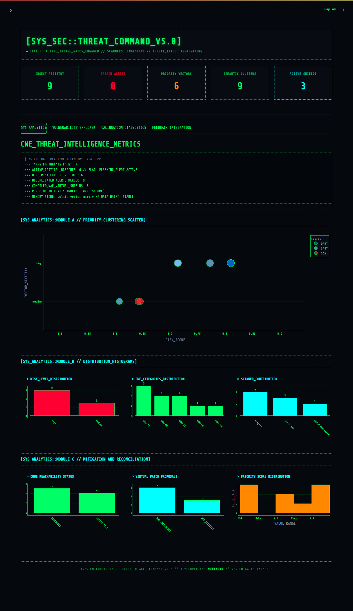
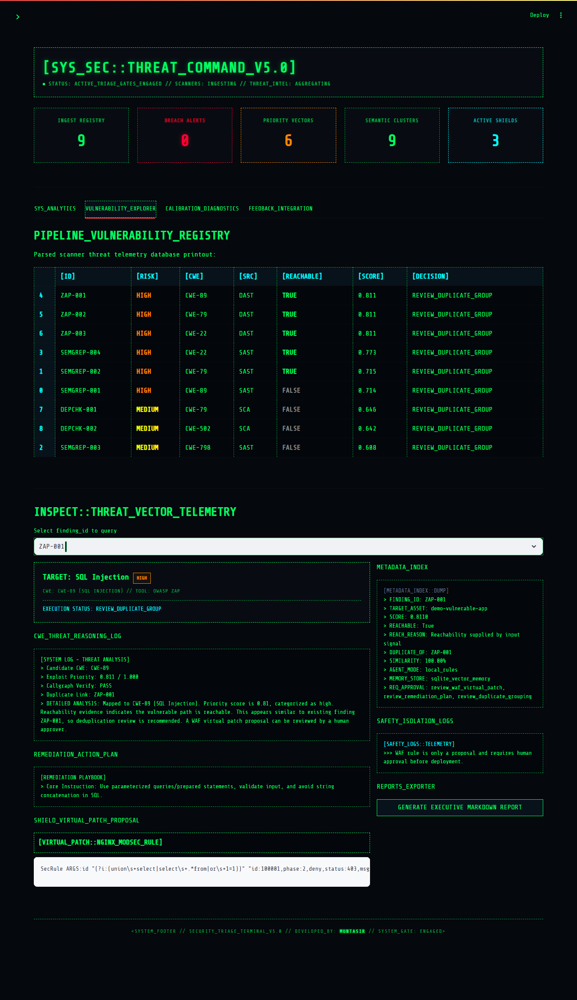
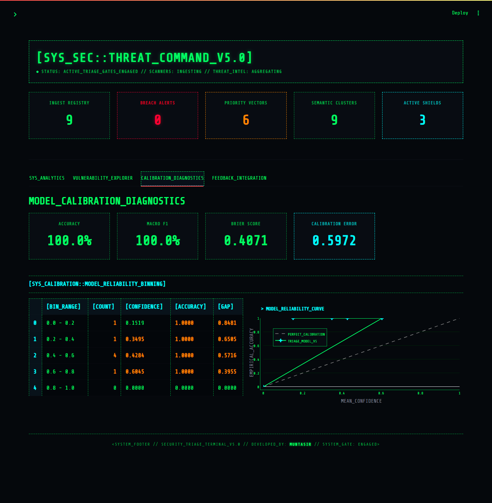
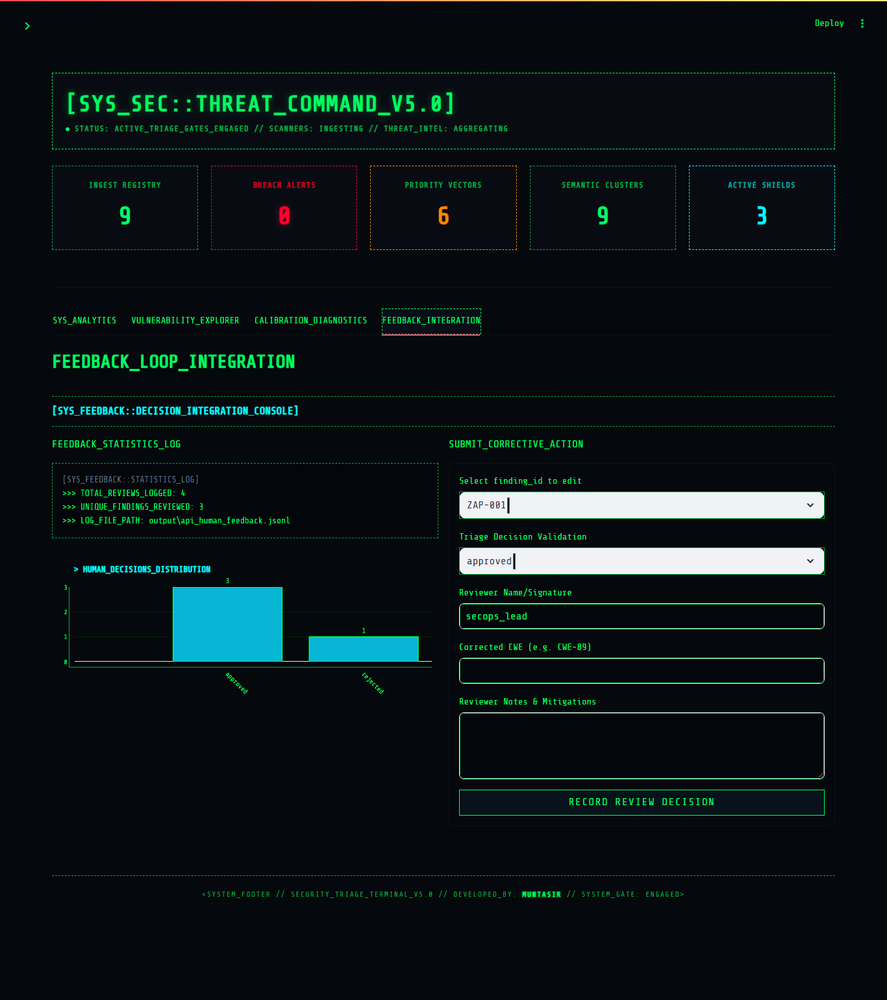

# Vulnerability AI Triage Lab v7.0

A runnable AppSec AI portfolio project that ingests scanner findings, normalizes them to CWE, deduplicates similar issues with vector-style memory, scores priority with explainable evidence, generates triage/fix recommendations, and enforces WAF/human-approval safety gates.

**v7 introduces MLflow Experiment Tracking for model parameter auditing and F1-score evaluation metrics.**

---

## What v7 Adds

| Feature | Status |
|---|---|
| **MLflow Experiment Tracking** | Centralized logs for accuracy/F1 metrics, parameters, and serialized joblib model artifacts |
| **Sentence-Transformers Classifier** | Upgrade from TF-IDF keyword counting to deep semantic embeddings (`all-MiniLM-L6-v2`) |
| **Dynamic Serialization & Lazy-Loading** | Custom state pickling keeps saved model footprint small (~20KB) and loads PyTorch dynamically |
| **Elastic Pipeline CLI Flags** | `--encoder` (`tfidf`/`embeddings`) and `--embedding-model` arguments |
| **CWE calibration metrics** | Accuracy, macro-F1, Brier score, ECE, confidence bins |
| **Threat-intelligence enrichment** | Local exploit-likelihood fixture integrated into scoring evidence |
| **Callgraph-style reachability fixture** | Simulates CodeQL/Joern integration contract without heavy dependencies |
| **Audit log** | CLI can write append-only JSONL decision records |
| **Feedback-to-training loop** | Human feedback can generate augmented CWE training data |
| **MCP-style tool contracts** | Local contracts for future MCP server/tool integration |
| **v7 architecture documentation** | `doc/v7.0_explanation.md` / `doc/updates_v6_to_v7.md` |

v7 keeps all prior features: scanner adapters, vulnerable demo app, Streamlit dashboard, FastAPI API, Docker Compose, ML classifier, SQLite memory, WAF safety gate, and tests.

---

## Dashboard Preview

The interactive Streamlit dashboard is designed as a real SecOps hacking console terminal, featuring custom neon-styled telemetry plots and a military-cockpit style vulnerability debugger.


### Core Operational Cockpit Views

| Module Screen | Preview | Description |
|---|---|---|
| **System Analytics** |  | Real-time threat telemetry data dump, risk distribution histogram, CWE categories count, and code reachability statistics. |
| **Vulnerability Explorer** |  | Telemetry database printout table, detailed reasoning logs, remediation playbook, WAF rules generator, and metadata dump. |
| **Model Calibration Diagnostics** |  | Model reliability curve plotting confidence vs accuracy against a perfect calibration reference, alongside calibration stats. |
| **Feedback Loop Integration** |  | Human corrective actions submission form and reviews telemetry log. |

---

## Architecture

```text
Security scanner outputs
Semgrep / OWASP ZAP / Dependency-Check
        ↓
Scanner adapters
        ↓
Canonical VulnerabilityFinding schema
        ↓
CWE normalization: rules or ML classifier
        ↓
Threat-intelligence enrichment
        ↓
Entity extraction
        ↓
Vector-style memory deduplication
        ↓
Callgraph/reachability gate
        ↓
Bayesian-style priority scoring
        ↓
Local or optional LLM triage agent
        ↓
WAF proposal gate
        ↓
Human approval policy
        ↓
Audit log / feedback loop / API / dashboard / reports / benchmark
```

---

## Tech Stack

Here is the structured technology stack used in the project:

| Layer / Component | Technology / Library | Purpose & Description | Key Implementation Reference |
| :--- | :--- | :--- | :--- |
| **Core Language** | Python (>= 3.10) | Main runtime environment and source code language | Whole Project |
| **Web Framework & API** | FastAPI | Exposes high-performance asynchronous REST endpoints for triage, feedback, and MCP tools | [app/main.py](app/main.py) |
| **ASGI Server** | Uvicorn | Serves the FastAPI web server locally | Run scripts & CLI commands |
| **GUI Dashboard** | Streamlit | Powers the neon-themed SecOps Cockpit UI console for telemetry, diagnostics, and human feedback | [app/dashboard/streamlit_app.py](app/dashboard/streamlit_app.py) |
| **Schema Validation** | Pydantic (v2) | Enforces strict validation and schemas for security scanner findings and triage outputs | [app/schemas.py](app/schemas.py) |
| **Primary Vector Storage** | SQLite | Default local, lightweight persistent database storing vulnerability logs and vectorized representation | [app/storage/sqlite_vector_memory.py](app/storage/sqlite_vector_memory.py) |
| **Advanced Vector DB** | ChromaDB *(Advanced)* | High-performance, production-grade vector database implementation | [app/storage/chroma_memory_store.py](app/storage/chroma_memory_store.py) |
| **Machine Learning** | Scikit-Learn | Powers the TF-IDF and Sentence-Transformers feature extraction pipeline along with the Logistic Regression CWE classification model | [app/ml/train_cwe_classifier.py](app/ml/train_cwe_classifier.py) |
| **Model Serialization** | Joblib | Saves and loads the trained Scikit-Learn classifiers | [app/ml/cwe_ml_classifier.py](app/ml/cwe_ml_classifier.py) |
| **Data Manipulation** | Pandas & NumPy | Used for matrix manipulation, Expected Calibration Error (ECE) bins, and accuracy calculations | [app/ml/calibration.py](app/ml/calibration.py) |
| **LLM Client Interface** | OpenAI API / Sentence-Transformers | Communicates with `gpt-4o-mini` for triage and encodes semantic representations using HuggingFace encoders | [app/agents/llm_agent.py](app/agents/llm_agent.py) / [app/embeddings/providers.py](app/embeddings/providers.py) |
| **Agent Workflows** | LangGraph *(Advanced)* | Optional state-machine orchestration framework for complex multi-agent execution flows | [requirements-advanced.txt](requirements-advanced.txt) |
| **Vitals & Monitoring** | MLflow & Evidently | Experiment tracking for model training metrics and parameters, plus data drift telemetry | [app/ml/train_cwe_classifier.py](app/ml/train_cwe_classifier.py) / [requirements-advanced.txt](requirements-advanced.txt) |
| **Testing Framework** | pytest | Executes backend test suites to verify adapter parsers, scorer weights, custom encoder mock checks, and MLflow logging | [pyproject.toml](pyproject.toml) |
| **Static Documentation** | MkDocs & Material | Serves the project architecture and setup documentation pages | [mkdocs.yml](mkdocs.yml) |
| **Containerization** | Docker & Compose | Bundles and runs the dashboard, API, and target demo application in isolated environments | [Dockerfile](Dockerfile) / [docker-compose.yml](docker-compose.yml) |

---

## Alignment

| Requirement / Domain | Key Criteria | Project Component & Tech Used | Key Implementation Reference |
| :--- | :--- | :--- | :--- |
| **NLP & CWE Normalization** | Classification, entity extraction, and vulnerability fingerprinting mapping schemas to CWE. | • Sentence-Transformers Embeddings (Upgrade)<br>• TF-IDF + Logistic Regression (Fallback)<br>• Regex-based Entity Extraction<br>• Bag-of-words / Semantic similarity | • [train_cwe_classifier.py](app/ml/train_cwe_classifier.py)<br>• [cwe_classifier.py](app/normalization/cwe_classifier.py)<br>• [entity_extractor.py](app/normalization/entity_extractor.py) |
| **Bayesian Scoring & Calibration** | Scoring systems calibrated rather than just ranked, using CVSS, reachability, exploit, and business context. | • Confidence-weighted scoring formula<br>• Multiclass Brier Score<br>• Expected Calibration Error (ECE)<br>• Reliability Bins Mapping | • [bayesian_score.py](app/scoring/bayesian_score.py)<br>• [calibration.py](app/ml/calibration.py) |
| **Vulnerability Memory & Retrieval** | Vector databases and embedding retrieval for long-term organizational memory and deduplication. | • SQLite vector-like persistent store<br>• ChromaDB integration<br>• Custom deterministic Hashed Embeddings<br>• Neural SentenceTransformers | • [sqlite_vector_memory.py](app/storage/sqlite_vector_memory.py)<br>• [chroma_memory_store.py](app/storage/chroma_memory_store.py)<br>• [providers.py](app/embeddings/providers.py) |
| **Reachability Analysis** | Reachability gates filtering SAST findings through callgraph/data-flow to reduce noise. | • Simulated static callgraph mapping<br>• File path & route mapping gates | • [reachability_gate.py](app/reachability/reachability_gate.py)<br>• [callgraph_reachability.py](app/reachability/callgraph_reachability.py) |
| **Agentic AI & Remediation** | Multi-step triage agent, structured output prompting, MCP server contracts, and WAF patch proposal. | • OpenAI JSON response format structures<br>• MCP-style tool JSON schema contracts<br>• ModSecurity WAF patch proposals<br>• Hard approval gates at system levels | • [llm_agent.py](app/agents/llm_agent.py)<br>• [tool_contracts.py](app/mcp/tool_contracts.py)<br>• [waf_gate.py](app/waf/waf_gate.py)<br>• [approval_policy.py](app/policy/approval_policy.py) |
| **ML Operations (MLOps)** | Human feedback loops, retraining datasets, experiment logs, and audit logs. | • MLflow Experiment Tracking (v7.0 Upgrade)<br>• Corrective actions feedback merger<br>• Append-only JSONL decision loggers<br>• Evidently data drift analysis | • [train_cwe_classifier.py](app/ml/train_cwe_classifier.py)<br>• [build_training_set.py](app/feedback/build_training_set.py)<br>• [audit_logger.py](app/audit/audit_logger.py) |
| **AppSec Domain Knowledge** | OWASP Top 10, CWE taxonomy, and schema inconsistencies across SAST, DAST, and SCA. | • Dedicated adapters for Semgrep (SAST), OWASP ZAP (DAST), and Dependency-Check (SCA) parsing to common schemas. | • [app/scanners/](app/scanners/) |

---

## Quick Start

```bash
cd vuln-ai-triage-lab-v7
python -m venv .venv
```

### Windows

```bash
.venv\Scripts\activate
```

### Linux / macOS

```bash
source .venv/bin/activate
```

Install dependencies:

```bash
pip install -r requirements.txt
```

Train the ML CWE classifier:

**Using TF-IDF (default):**
```bash
python -m app.ml.train_cwe_classifier --input data/cwe_training_findings.jsonl --output models/cwe_tfidf_logreg.joblib --metrics output/cwe_training_metrics.json --encoder tfidf
```

**Using Sentence-Transformers Embeddings:**
```bash
python -m app.ml.train_cwe_classifier --input data/cwe_training_findings.jsonl --output models/cwe_tfidf_logreg.joblib --metrics output/cwe_training_metrics.json --encoder embeddings
```

**Using Embeddings + MLflow Experiment Tracking:**
```bash
python -m app.ml.train_cwe_classifier --input data/cwe_training_findings.jsonl --output models/cwe_tfidf_logreg.joblib --metrics output/cwe_training_metrics.json --encoder embeddings --mlflow --mlflow-experiment "CWE_Classifier_Triage"
```

To view the tracking dashboard, start the MLflow server:
```bash
mlflow ui
```

Generate canonical findings from scanner fixtures:

```bash
python -m app.scanners.run_all --output output/scanner_findings_all.json
```

Run the v6 AI pipeline with audit logging:

```bash
python -m app.cli --input output/scanner_findings_all.json --use-ml --memory-backend sqlite --memory-file output/v6_memory.sqlite --output output/v6_results_ml.json --report output/v6_report_ml.md --audit-log output/v6_audit_log.jsonl --pretty
```

Run the v6 calibration report:

```bash
python -m app.evaluation.model_calibration --input data/sample_findings_all.json --labels data/eval_labeled_findings.json --output output/v6_cwe_calibration_metrics.json --report output/v6_cwe_calibration_report.md
```

Run the combined v6 benchmark:

```bash
python -m app.evaluation.full_benchmark_v6 --use-ml --output output/v6_full_benchmark_metrics.json --report output/v6_full_benchmark_report.md
```

Run all v6 demo steps:

```bash
bash scripts/run_v6_demo.sh
```

On Windows:

```bat
scripts\run_v6_demo.bat
```

---

## Run the API

```bash
uvicorn app.main:app --reload
```

Open:

```text
http://127.0.0.1:8000/docs
```

Useful endpoints:

| Endpoint | Purpose |
|---|---|
| `POST /triage` | Triage one finding |
| `POST /triage/batch` | Triage a list of findings |
| `GET /demo/scanner-fixtures` | Convert bundled scanner fixtures into canonical findings |
| `POST /demo/scanner-fixtures/triage` | Run full triage over bundled scanner fixtures |
| `GET /memory/summary` | Check persistent memory summary |
| `POST /feedback` | Add human review feedback |
| `GET /feedback/summary` | Summarize feedback |
| `GET /mcp/tool-contracts` | Show MCP-style tool contracts |

---

## Run the Dashboard

First create scanner findings:

```bash
python -m app.scanners.run_all --output output/scanner_findings_all.json
python -m app.cli --input output/scanner_findings_all.json --use-ml --output output/v6_results_ml.json --pretty
```

Then run:

```bash
streamlit run app/dashboard/streamlit_app.py
```

Open:

```text
http://localhost:8501
```

---

## Calibration Metrics

v6 adds model-confidence evaluation:

| Metric | Why it matters |
|---|---|
| Accuracy | Overall CWE classification correctness |
| Macro-F1 | Handles imbalanced CWE classes better than accuracy alone |
| Multiclass Brier score | Measures probabilistic error |
| Expected Calibration Error | Measures whether confidence matches real correctness |
| Reliability bins | Shows confidence bucket vs actual accuracy |


---

## Feedback Retraining Loop

After collecting feedback through the API, convert corrected feedback into training data:

```bash
python -m app.feedback.build_training_set --base data/cwe_training_findings.jsonl --results output/v6_results_ml.json --feedback output/api_human_feedback.jsonl --output output/cwe_training_augmented_from_feedback.jsonl
```

Then retrain:

```bash
python -m app.ml.train_cwe_classifier --input output/cwe_training_augmented_from_feedback.jsonl --output models/cwe_tfidf_logreg.joblib --metrics output/cwe_training_metrics_after_feedback.json
```

---

## Scanner Integration

### Offline fixture mode

These commands work even if the scanner tools are not installed:

```bash
python -m app.scanners.run_semgrep --sample --output output/semgrep_findings.json
python -m app.scanners.run_zap --sample --output output/zap_findings.json
python -m app.scanners.run_dependency_check --sample --output output/dependency_check_findings.json
```

### Real scanner mode

If installed, you can run real tools:

```bash
python -m app.scanners.run_semgrep --target demo-vulnerable-app --output output/semgrep_findings.json
python -m app.scanners.run_zap --target http://localhost:5000 --output output/zap_findings.json
python -m app.scanners.run_dependency_check --target demo-vulnerable-app --output output/dependency_check_findings.json
```

---

## Demo Vulnerable App

The project includes:

```text
demo-vulnerable-app/
```

Intentional vulnerabilities:

| Route / Item | Vulnerability | CWE |
|---|---|---|
| `/user?id=1` | SQL Injection | CWE-89 |
| `/search?q=test` | Reflected XSS | CWE-79 |
| `/download?file=sample.txt` | Path Traversal | CWE-22 |
| `API_KEY` in source | Hard-coded secret | CWE-798 |
| `requirements.txt` | Vulnerable dependency examples | SCA/CVE |

Do not deploy the demo vulnerable app publicly.

---

## Docker Compose

```bash
docker compose up --build
```

Services:

| Service | URL |
|---|---|
| API | `http://localhost:8000/docs` |
| Dashboard | `http://localhost:8501` |
| Demo vulnerable app | `http://localhost:5000` |

---

## Tests

```bash
pytest
```

---

## Explanation


> Designed the system as a modular vulnerability intelligence pipeline. Scanner adapters isolate schema inconsistencies from SAST, DAST, and SCA tools. The canonical schema feeds CWE normalization, threat-intelligence enrichment, entity extraction, deduplication, reachability checks, and explainable priority scoring. The triage agent generates human-readable guidance, but safety-sensitive actions like WAF rule eligibility are enforced by deterministic code outside the LLM. v6 adds calibration metrics, audit logs, and a feedback-to-training loop so the project demonstrates not only modeling but evaluation and governance discipline.

---

## Current Limitations

- The bundled scanner outputs are fixtures unless real tools are installed.
- The ML classifier is still a small baseline model, not a production transformer.
- Callgraph reachability is a fixture-based simulation, not full CodeQL/Joern data-flow analysis.
- WAF rules are proposals only; there is no automatic deployment.
- LLM integration is optional and safely falls back to local triage.
- Calibration metrics are demonstrated on a small dataset; production claims require historical labeled data.

---

## Recommended v7 Direction

- Replace TF-IDF classifier with fine-tuned Transformer / CodeBERT.
- Use Qdrant or pgvector as default vector DB.
- Add real CodeQL or Joern reachability output parser.
- Add MLflow experiment tracking and model registry.
- Add CI benchmark gates that fail if WAF false positive rate or calibration worsens.
- Add full MCP server runtime for tool-using remediation agents.
