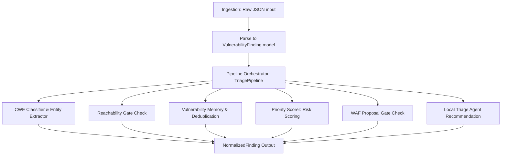

# Vuln AI Triage Lab - প্রজেক্ট পরিচিতি ও কার্যপ্রণালী

এই প্রজেক্টটি একটি **AI-assisted AppSec vulnerability intelligence pipeline** বা স্বয়ংক্রিয় নিরাপত্তা ত্রুটি সনাক্তকরণ ও ট্রিয়েজ পাইপলাইন। এটি বিভিন্ন সিকিউরিটি টুলস (যেমন: SAST, DAST, SCA) থেকে প্রাপ্ত র ফিন্ডিংগুলোকে (raw findings) গ্রহণ করে সেগুলোকে একটি নির্দিষ্ট স্ট্যান্ডার্ডে রূপান্তর করে, ডুপ্লিকেট সনাক্ত করে, ত্রুটির গুরুত্ব অনুযায়ী স্কোরিং করে এবং ভার্চুয়াল প্যাচ বা WAF (Web Application Firewall) রুল প্রোপোজাল তৈরি করে।

নিচে প্রতিটি কম্পোনেন্ট কীভাবে এবং কেন কাজ করে তা বাংলায় বিস্তারিত ব্যাখ্যা করা হলো।

---

## ১. ডাটা ফ্লো (System Architecture & Data Flow)

পাইপলাইনে ডাটা ফ্লো বা প্রসেসিং নিচের ধাপগুলো অনুসরণ করে সম্পন্ন হয়:

---

## ২. প্রতিটি কম্পোনেন্টের বিস্তারিত কোড ব্যাখ্যা (Component Breakdown)

### ক. ডাটা স্কিমা (Data Schemas)
* **ফাইল:** [app/schemas.py](file:///g:/vuln-ai-triage-lab/app/schemas.py)
* **কীভাবে কাজ করে:** **Pydantic** লাইব্রেরি ব্যবহার করে ইনপুট ও আউটপুট এর ডাটা স্ট্রাকচার নির্ধারণ করা হয়েছে।
  * `VulnerabilityFinding`: নিরাপত্তা স্ক্যানার থেকে আসা প্রাথমিক রিপোর্টের ডাটা রিপ্রেজেন্ট করে (যেমন: CVSS স্কোর, এন্ডপয়েন্ট, প্যারামিটার, ফাইল পাথ ইত্যাদি)।
  * `NormalizedFinding`: পাইপলাইনের সম্পূর্ণ প্রসেস শেষে যে ডেটা আউটপুট হিসেবে পাওয়া যায় তা ধারণ করে। এর মধ্যে CWE আইডি, ডুপ্লিকেট আইডি, স্কোরিং হিসেব এবং WAF রুলস থাকে।
* **কেন কাজ করে:** বিভিন্ন সিকিউরিটি টুল আলাদা আলাদা ফরম্যাটে আউটপুট দেয়। সেগুলোকে একটি সাধারণ স্ট্যান্ডার্ড ফরম্যাটে রূপান্তর না করলে পরবর্তীতে প্রসেসিং করা কঠিন হয়ে পড়ে। Pydantic এর মাধ্যমে টাইপ ভ্যালিডেশন এবং ডাটা স্ট্যান্ডার্ডাইজেশন সহজ হয়।

---

### খ. ইনজেশন অ্যাডাপ্টার (Ingestion Adapter)
* **ফাইল:** [app/ingestion/adapters.py](file:///g:/vuln-ai-triage-lab/app/ingestion/adapters.py)
* **কীভাবে কাজ করে:** `parse_generic_findings` ফাংশনটি ইনপুট হিসেবে আসা কাঁচা বা র (raw) JSON ডাটাকে পার্স করে `VulnerabilityFinding` অবজেক্টের একটি লিস্টে পরিণত করে।
* **কেন কাজ করে:** এটি মূলত একটি ট্রান্সলেশন লেয়ার। ভবিষ্যতে কোনো নতুন টুল (যেমন Semgrep বা OWASP ZAP) পাইপলাইনে যুক্ত করতে চাইলে শুধুমাত্র এই ফাইলে তাদের নিজস্ব ফরম্যাটকে ম্যাপ করে `VulnerabilityFinding` এ রূপান্তর করার কোড লিখলেই চলবে।

---

### গ. নরমালাইজেশন: CWE ক্লাসিফায়ার এবং এনটিটি এক্সট্র্যাক্টর (CWE Classifier & Entity Extractor)
* **ফাইল:** 
  * [app/normalization/cwe_classifier.py](file:///g:/vuln-ai-triage-lab/app/normalization/cwe_classifier.py)
  * [app/normalization/entity_extractor.py](file:///g:/vuln-ai-triage-lab/app/normalization/entity_extractor.py)
* **CWE Classifier কীভাবে কাজ করে:**
  * এই মডিউলে একটি ডিকশনারি বা ম্যাপিং (`CWE_RULES`) আছে যেখানে কমন কিছু CWE ক্যাটাগরি (যেমন SQLi, XSS, Path Traversal) এবং তাদের সাথে সংশ্লিষ্ট কিছু Keywords ডিফাইন করা আছে।
  * ইনপুট ত্রুটির টাইটেল, ডেসক্রিপশন এবং এন্ডপয়েন্ট থেকে টেক্সট নিয়ে কি-ওয়ার্ডগুলোর সাথে ম্যাচ করানো হয়।
  * ম্যাচিং কি-ওয়ার্ডের ঘনত্বের ওপর ভিত্তি করে একটি কনফিডেন্স স্কোর (Confidence Score) হিসাব করা হয়। কোনো কি-ওয়ার্ড না মিললে এটি ডিফল্ট হিসেবে `CWE-20` (Improper Input Validation) ধরে নেয়।
* **Entity Extractor কীভাবে কাজ করে:**
  * Regular Expression (Regex) ব্যবহার করে টেক্সটের ভেতর থেকে গুরুত্বপূর্ণ প্যারামিটার যেমন: API এন্ডপয়েন্ট (যেমন `/api/...`), ফাইল পাথ, প্যারামিটার নাম (যেমন `param`, `id`), প্যাকেজ নাম ও ভার্সন খুঁজে বের করে।
* **কেন কাজ করে:** বেশিরভাগ স্ক্যানার রিপোর্ট স্পষ্ট বা স্ট্যান্ডার্ড হয় না। রুলে-ভিত্তিক কি-ওয়ার্ড ও রেগুলার এক্সপ্রেশন ব্যবহার করে কোনো পেইড এপিআই ছাড়াই স্থানীয়ভাবে খুব দ্রুত ত্রুটির ধরন ও আক্রান্ত স্থান সনাক্ত করা সম্ভব হয়।

---

### ঘ. ডুপ্লিকেট সনাক্তকরণ এবং ভেক্টর মেমরি (Deduplication & Vector Memory)
* **ফাইল:**
  * [app/retrieval/hash_embeddings.py](file:///g:/vuln-ai-triage-lab/app/retrieval/hash_embeddings.py)
  * [app/storage/memory_store.py](file:///g:/vuln-ai-triage-lab/app/storage/memory_store.py)
* **Hash Embedding কীভাবে কাজ করে:**
  * এটি মূলত একটি সাধারণ বা লাইটওয়েট লোকাল এমবেডিং মডেল। টেক্সটকে প্রথমে টোকেনাইজ করে ছোট হাতের অক্ষরে রূপান্তর করে।
  * এরপর প্রতিটি টোকেনকে MD5 হ্যাশ অ্যালগরিদম দিয়ে হ্যাশ করে নির্দিষ্ট ডাইমেনশনে (যেমন: ১২৮ সাইজের অ্যারে) ম্যাপ করে।
  * টোকেন কতবার এসেছে তার ওপর ভিত্তি করে লগারিদমিক ওয়েট (`1.0 + log(count)`) প্রয়োগ করা হয় এবং সর্বশেষে ভেক্টরটিকে নরমাল বা এল২-নরমালাইজেশন করে।
* **Memory Store কীভাবে কাজ করে:**
  * পূর্বে রিট্রিভ করা সকল ত্রুটির রেকর্ড এই মেমরিতে জমা থাকে।
  * নতুন কোনো ত্রুটি আসলে তার হ্যাশ ভেক্টর তৈরি করে মেমরির পুরনো রেকর্ডের ভেক্টরের সাথে `cosine_similarity` তুলনা করা হয়।
  * যদি নতুন ও পুরনো ত্রুটির CWE, অ্যাসেট বা এন্ডপয়েন্ট হুবহু মিলে যায়, তবে অতিরিক্ত বোনাস স্কোর যোগ হয়।
  * মিলের হার (Similarity Score) যদি `0.82` বা তার বেশি হয়, তবে এটিকে পূর্বের কোনো ভুলের **ডুপ্লিকেট** বা প্রতিলিপি হিসেবে গণ্য করা হয় এবং একই `duplicate_group_id` তে ফেলা হয়।
* **কেন কাজ করে:** রিয়েল-লাইফ ডেভলপমেন্টে একই ধরনের সিকিউরিটি ত্রুটি বারবার বিভিন্ন স্ক্যানার দিয়ে ধরা পড়তে পারে। লোকাল হ্যাশ এমবেডিং ব্যবহারের ফলে বাহ্যিক কোনো ভারী ভেক্টর ডাটাবেজ (যেমন Chroma বা pgvector) ছাড়াই খুব দ্রুত মেমোরিতে ডুপ্লিকেট আইডেন্টিফাই করা যায়।

---

### ঙ. রিচিবিলিটি গেট (Reachability Gate)
* **ফাইল:** [app/reachability/reachability_gate.py](file:///g:/vuln-ai-triage-lab/app/reachability/reachability_gate.py)
* **কীভাবে কাজ করে:** 
  * এটি চেক করে যে ত্রুটিটি আসলেই বাইরে থেকে অ্যাটাক করার উপযোগী বা রিচিবল (Reachable) কিনা।
  * যদি ফিন্ডিংটি DAST থেকে আসে, তবে ধরে নেয়া হয় যে এটি রিচিবল (যেহেতু ডাইনামিক স্ক্যানারটি রানিং সাইটে হিট করে ত্রুটিটি পেয়েছে)।
  * এন্ডপয়েন্ট যদি পাবলিক টাইপের হয় (যেমন `/api/`, `/checkout`, `/login`), তবে তা রিচিবল ধরা হয়।
  * SCA (লাইব্রেরি ডিপেন্ডেন্সি) এর ক্ষেত্রে এটি বাই-ডিফল্ট **নন-রিচিবল** হিসেবে সেট হয় যতক্ষণ না এক্সপ্লয়েট করার সরাসরি প্রমাণ পাওয়া যাচ্ছে।
* **কেন কাজ করে:** সিকিউরিটি অ্যালার্টে প্রায়ই অনেক ফালস পজিটিভ (False Positives) থাকে। রিচিবিলিটি গেট চেক করার মাধ্যমে ডেভলপাররা কেবল সেই ত্রুটিগুলো ঠিক করতে সময় ব্যয় করবেন যা আসলেই বাইরে থেকে হ্যাক করা সম্ভব।

---

### চ. প্রায়োরিটি স্কোরিং (Priority & Risk Scoring)
* **ফাইল:** [app/scoring/bayesian_score.py](file:///g:/vuln-ai-triage-lab/app/scoring/bayesian_score.py)
* **কীভাবে কাজ করে:** 
  * একটি ট্রান্সপারেন্ট গাণিতিক সমীকরণের মাধ্যমে ত্রুটির গুরুত্ব বা প্রায়োরিটি স্কোর হিসাব করা হয়। ফ্যাক্টরগুলো হলো:
    * **CVSS Score Weight ($22\%$):** টুলের দেওয়া বেসিক ভ্যালু।
    * **CWE Confidence ($18\%$):** ক্লাসিফায়ার কতটা নিশ্চিত।
    * **Source Type Confidence ($15\%$):** DAST হলে বেশি ট্রাস্টেড, SAST হলে তুলনামূলক কম।
    * **Reachability Weight ($15\%$):** কোডটি রিচিবল না হলে স্কোর কমে যায়।
    * **Exploit Availability ($10\%$):** এক্সপ্লয়েট কোড ইন্টারনেটে সহজলভ্য কিনা।
    * **Business Criticality ($10\%$):** সার্ভার বা অ্যাসেটের ব্যবসায়িক গুরুত্ব।
    * **Asset Exposure ($7\%$):** ইন্টারনেট ফেইসিং নাকি ইন্টারনাল।
    * **Correlation Weight ($3\%$):** DAST এবং SAST উভয় মাধ্যমে ভেরিফায়েড কিনা।
  * যদি ডুপ্লিকেট হয়, তবে মূল স্কোরের সাথে পেনাল্টি হিসেবে `0.88` গুণ করা হয় (ডুপ্লিকেটের প্রায়োরিটি একটু কমানোর জন্য)।
  * স্কোর অনুযায়ী একে ৪টি রিস্ক লেভেলে ভাগ করা হয়: Critical ($\ge 0.82$), High ($\ge 0.68$), Medium ($\ge 0.45$), এবং Low।
* **কেন কাজ করে:** শুধু CVSS এর ওপর নির্ভর করলে গুরুত্ব বোঝা যায় না। উদাহরণস্বরূপ, ইন্টারনাল সার্ভারের একটি ছোট ত্রুটি এবং ইন্টারনেট ফেইসিং পেমেন্ট গেটওয়ের একটি বড় ত্রুটি কখনোই এক হতে পারে না। এই স্কোরিং সিস্টেমটি ব্যবসায়িক দিক এবং টেকনিক্যাল দিক মিলিয়ে সঠিক প্রায়োরিটি নির্ধারণ করে।

---

### ছ. WAF গেট এবং ভার্চুয়াল প্যাচিং (WAF Gate / Virtual Patching)
* **ফাইল:** [app/waf/waf_gate.py](file:///g:/vuln-ai-triage-lab/app/waf/waf_gate.py)
* **কীভাবে কাজ করে:**
  * এটি স্বয়ংক্রিয়ভাবে ModSecurity রুল প্রস্তাবনা তৈরি করে। তবে এর জন্য কঠোর নিরাপত্তা গেট বসানো আছে:
    * **SAST-Only ব্লক:** শুধুমাত্র SAST থেকে আসা ফিন্ডিং এর জন্য কোনো WAF রুল জেনারেট করা যাবে না (কারণ এতে ফালস পজিটিভের কারণে সাধারণ ইউজারদের রিকোয়েস্ট ব্লক হয়ে যাওয়ার সম্ভাবনা থাকে)।
    * **CWE যোগ্যতা:** শুধু SQLi, XSS, Path Traversal, SSRF এর মতো ওয়েব ইনপুট ত্রুটির জন্য এটি প্রযোজ্য।
    * **স্কোর সীমা:** প্রায়োরিটি স্কোর অবশ্যই `0.75` বা তার বেশি হতে হবে।
    * **রিচিবিলিটি:** কোডটি অবশ্যই রিচিবল হতে হবে।
* **কেন কাজ করে:** কোডে মূল বাগ ফিক্স করার আগ পর্যন্ত সাময়িকভাবে প্রোডাকশনকে সুরক্ষিত রাখার জন্য WAF রুল অত্যন্ত কার্যকর। তবে ফালস পজিটিভের কারণে সিস্টেম যাতে বন্ধ না হয়, সেজন্য শক্ত লজিক্যাল গেট দিয়ে এটি নিয়ন্ত্রণ করা হয়।

---

### জ. ট্রিয়েজ এজেন্ট (Triage Agent)
* **ফাইল:** [app/agents/triage_agent.py](file:///g:/vuln-ai-triage-lab/app/agents/triage_agent.py)
* **কীভাবে কাজ করে:** এটি সম্পূর্ণ লোকাল ও ডিটারমিনিস্টিক লজিক ব্যবহার করে একজন মানুষের মতো ট্রিয়েজ সিদ্ধান্ত দেয়:
  * সিদ্ধান্তসমূহ: `urgent_fix_required` (জরুরী সমাধান আবশ্যক), `deprioritize_until_reachability_confirmed` (রিচিবিলিটি নিশ্চিত না হওয়া পর্যন্ত ডি-প্রায়োরিটাইজ করা), `review_duplicate_group` (ডুপ্লিকেট চেক), অথবা `standard_security_backlog` (সাধারণ ব্যাকলগ)।
  * এটি মানুষের পড়ার উপযোগী ব্যাখ্যা এবং CWE অনুযায়ী সমাধান বা ফিক্স গাইডলাইনও তৈরি করে।
* **কেন কাজ করে:** এটি মূলত অ্যাডভাইজরি রোল প্লে করে। মানুষের বুঝতে সুবিধা হওয়ার জন্য একটি সামারি তৈরি করে দেয়, অথচ এর মূল সিদ্ধান্তগুলো হার্ডকোডেড নিয়ম মেনে চলে যা কোনো ফালস ডিসিশন মেকিং এড়ায়।

---

### ঝ. পাইপলাইন অর্কেস্ট্রেটর (Pipeline Orchestrator)
* **ফাইল:** [app/pipeline.py](file:///g:/vuln-ai-triage-lab/app/pipeline.py)
* **কীভাবে কাজ করে:** এটি উপরে বর্ণিত সকল ধাপ বা মডিউলকে একত্রিত করে। `process_one` ফাংশনের মাধ্যমে একটি সিঙ্গেল ফিন্ডিংকে পাইপলাইনের সবকটি ধাপের মধ্য দিয়ে নিয়ে গিয়ে পরিশেষে একটি ফাইনাল `NormalizedFinding` আউটপুট অবজেক্ট তৈরি করে।

---

## ৩. প্রজেক্টের ইন্টারফেস এবং ভেরিফিকেশন (Interfaces & Verification)

* **FastAPI অ্যাপ ([app/main.py](file:///g:/vuln-ai-triage-lab/app/main.py)):** ওয়েব এপিআই এর মাধ্যমে ইনপুট গ্রহণ করে প্রসেস করতে সাহায্য করে। `/triage` এপিআই অ্যান্ডপয়েন্টটি এর মূল এন্ট্রি পয়েন্ট।
* **CLI টুল ([app/cli.py](file:///g:/vuln-ai-triage-lab/app/cli.py)):** কমান্ড লাইনের মাধ্যমে ফাইল প্রসেস করে টার্মিনালে আউটপুট দেখায়।
* **ইভালুয়েশন টুল ([app/evaluation/evaluate.py](file:///g:/vuln-ai-triage-lab/app/evaluation/evaluate.py)):** লেবেলড ডাটা ইনপুট নিয়ে CWE ক্লাসিফায়ারটির সঠিকতা (Accuracy) পরীক্ষা করে।

---

## ৪. প্রজেক্টের গুরুত্বপূর্ণ সেফটি রুলস (Strict Safety Rules)

১. **SAST-Only findings do not generate WAF rules:** শুধুমাত্র স্ট্যাটিক অ্যানালাইসিস ফাইন্ডিংসের ওপর ভিত্তি করে কখনো লাইভ WAF ফিল্টার বসানো যাবে না। এতে সাধারণ কাস্টমারদের ডাটা অ্যাক্সেস ব্লক হওয়ার সম্ভাবনা থাকে।
২. **Human approval required:** প্রতিটি প্রস্তাবিত WAF রুল ও ট্রিয়েজ সিদ্ধান্তের পাশে `human_approval_required=True` ফ্ল্যাগ অন থাকে। অর্থাৎ এটি সরাসরি লাইভ সিস্টেমে এপ্লাই হয় না, মানুষের রিভিউ আবশ্যিক।
৩. **Advisory agent limit:** ট্রিয়েজ সিদ্ধান্ত ও ফিক্স গাইড তৈরিতে লোকাল এজেন্ট সহায়তা করে, কিন্তু মূল সেফটি ও পলিসিগুলো ডাইরেক্ট পাইথন কোড দ্বারা এনফোর্স করা হয়।
