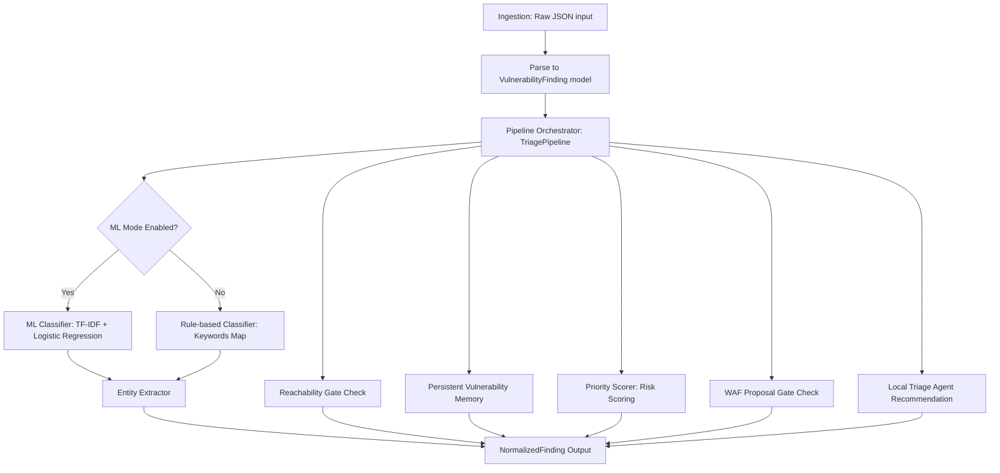

# Vuln AI Triage Lab v2 - প্রজেক্ট পরিচিতি ও কার্যপ্রণালী

এই প্রজেক্টটি একটি **AI-assisted AppSec vulnerability intelligence pipeline** বা স্বয়ংক্রিয় নিরাপত্তা ত্রুটি সনাক্তকরণ ও ট্রিয়েজ পাইপলাইন। এটি বিভিন্ন সিকিউরিটি টুলস (যেমন: SAST, DAST, SCA) থেকে প্রাপ্ত র ফিন্ডিংগুলোকে (raw findings) গ্রহণ করে সেগুলোকে একটি নির্দিষ্ট স্ট্যান্ডার্ডে রূপান্তর করে, ডুপ্লিকেট সনাক্ত করে, ত্রুটির গুরুত্ব অনুযায়ী স্কোরিং করে এবং ভার্চুয়াল প্যাচ বা WAF (Web Application Firewall) রুল প্রোপোজাল তৈরি করে।

সংস্করণ ২ (v2) এ আগের রুল-ভিত্তিক কাঠামোর উপরে একটি **ট্রেনযোগ্য মেশিন লার্নিং (ML) পাইপলাইন**, **পারসিস্টেন্ট মেমরি স্টোর**, এবং **উন্নত ব্যাচ রিপোর্টিং ও মূল্যায়ন (Evaluation)** ব্যবস্থা যুক্ত করা হয়েছে।

নিচে প্রতিটি কম্পোনেন্ট কীভাবে এবং কেন কাজ করে তা বাংলায় বিস্তারিত ব্যাখ্যা করা হলো।

---

## ১. ডাটা ফ্লো (System Architecture & Data Flow)

পাইপলাইনে ডাটা ফ্লো বা প্রসেসিং নিচের ধাপগুলো অনুসরণ করে সম্পন্ন হয় (যেখানে ইচ্ছে করলেই ML এবং Rules মোড টগল করা সম্ভব):

---

## ২. প্রতিটি কম্পোনেন্টের বিস্তারিত কোড ব্যাখ্যা (Component Breakdown)

### ক. ডাটা স্কিমা (Data Schemas)
* **ফাইল:** [app/schemas.py](file:///g:/vuln-ai-triage-lab/app/schemas.py)
* **কীভাবে কাজ করে:** **Pydantic** লাইব্রেরি ব্যবহার করে ইনপুট ও আউটপুট এর ডাটা স্ট্রাকচার নির্ধারণ করা হয়েছে।
  * `VulnerabilityFinding`: নিরাপত্তা স্ক্যানার থেকে আসা প্রাথমিক রিপোর্টের ডাটা রিপ্রেজেন্ট করে (যেমন: CVSS স্কোর, এন্ডপয়েন্ট, প্যারামিটার, ফাইল পাথ ইত্যাদি)।
  * `NormalizedFinding`: পাইপলাইনের সম্পূর্ণ প্রসেস শেষে যে ডেটা আউটপুট হিসেবে পাওয়া যায় তা ধারণ করে। এর মধ্যে CWE আইডি, ডুপ্লিকেট আইডি, স্কোরিং হিসেব এবং WAF রুলস থাকে।
* **কেন কাজ করে:** বিভিন্ন সিকিউরিটি টুল আলাদা আলাদা ফরম্যাটে আউটপুট দেয়। সেগুলোকে একটি সাধারণ স্ট্যান্ডার্ড ফরম্যাটে রূপান্তর না করলে পরবর্তীতে প্রসেসিং করা কঠিন হয়ে পড়ে। Pydantic এর মাধ্যমে টাইপ ভ্যালিডেশন এবং ডাটা স্ট্যান্ডার্ডাইজেশন সহজ হয়।

---

### খ. ইনজেশন অ্যাডাপ্টার (Ingestion Adapter)
* **ফাইল:** [app/ingestion/adapters.py](file:///g:/vuln-ai-triage-lab/app/ingestion/adapters.py)
* **কীভাবে কাজ করে:** `parse_generic_findings` ফাংশনটি ইনপুট হিসেবে আসা কাঁচা বা র (raw) JSON ডাটাকে পার্স করে `VulnerabilityFinding` অবজেক্টের একটি লিস্টে পরিণত করে।
* **কেন কাজ করে:** এটি মূলত একটি ট্রান্সলেশন লেয়ার। ভবিষ্যতে কোনো নতুন টুল (যেমন Semgrep বা OWASP ZAP) পাইপলাইনে যুক্ত করতে চাইলে শুধুমাত্র এই ফাইলে তাদের নিজস্ব ফরম্যাটকে ম্যাপ করে `VulnerabilityFinding` এ রূপান্তর করার কোড লিখলেই চলবে।

---

### গ. নরমালাইজেশন ও সিডব্লিউই ক্লাসিফিকেশন (CWE Classification & Normalization)
ত্রুটির টাইটেল ও ডেসক্রিপশন থেকে স্ট্যান্ডার্ড CWE কোড বের করার জন্য v2 এ দুটি আলাদা মোড রয়েছে:

#### ১. রুল-ভিত্তিক ক্লাসিফায়ার (Rule-based Classifier)
* **ফাইল:** [app/normalization/cwe_classifier.py](file:///g:/vuln-ai-triage-lab/app/normalization/cwe_classifier.py)
* **কীভাবে কাজ করে:** এটি একটি ডিকশনারি বা ম্যাপিং (`CWE_RULES`) ব্যবহার করে। ইনপুট টেক্সটের সাথে ডিফাইন করা কি-ওয়ার্ড ম্যাচ করে এবং ঘনত্বের ওপর ভিত্তি করে কনফিডেন্স স্কোর ও সংশ্লিষ্ট CWE আইডি নির্ধারণ করে।

#### ২. মেশিন লার্নিং ক্লাসিফায়ার (Trainable ML CWE Classifier)
* **ফাইল:** [app/ml/cwe_ml_classifier.py](file:///g:/vuln-ai-triage-lab/app/ml/cwe_ml_classifier.py) এবং [app/ml/train_cwe_classifier.py](file:///g:/vuln-ai-triage-lab/app/ml/train_cwe_classifier.py)
* **কীভাবে কাজ করে:** 
  * **ট্রেনিং:** `train_cwe_classifier.py` স্ক্রিপ্টটি `data/cwe_training_findings.jsonl` ডেটাসেট থেকে ইনপুট নিয়ে `scikit-learn` এর **TF-IDF Vectorizer** (নৈকট্য শব্দগুচ্ছ বা ngram সনাক্তকরণের জন্য) এবং **Logistic Regression** ব্যবহার করে মডেল ট্রেইন করে। মডেলটি [models/cwe_tfidf_logreg.joblib](file:///g:/vuln-ai-triage-lab/models/cwe_tfidf_logreg.joblib) এ সেভ করা হয়।
  * **প্রেডিকশন:** `cwe_ml_classifier.py` ফাইলটি ট্রেইন করা মডেলটি লোড করে নতুন ফাইন্ডিংয়ের জন্য CWE এবং সেটির সম্ভাব্য কনফিডেন্স প্রোবাবিলিটি স্কোর হিসেব করে।
* **কেন কাজ করে:** সাধারণ রুল বা কি-ওয়ার্ড ম্যাচিং সব ধরনের বিচিত্র টেক্সট প্যাটার্ন কাভার করতে পারে না। মেশিন লার্নিং ব্যবহারের ফলে মডেলটি শব্দগুচ্ছের সহাবস্থান ও প্যাটার্ন বুঝতে পারে এবং অধিক নির্ভুল ও স্বয়ংক্রিয় উপায়ে CWE শ্রেণীবিন্যাস সম্পন্ন করতে পারে।

---

### ঘ. ডুপ্লিকেট সনাক্তকরণ ও পারসিস্টেন্ট ভেক্টর মেমরি (Deduplication & Persistent Vector Memory)
* **ফাইল:**
  * [app/retrieval/hash_embeddings.py](file:///g:/vuln-ai-triage-lab/app/retrieval/hash_embeddings.py)
  * [app/storage/memory_store.py](file:///g:/vuln-ai-triage-lab/app/storage/memory_store.py)
* **Hash Embedding কীভাবে কাজ করে:**
  * এটি একটি সাধারণ বা লাইটওয়েট লোকাল এমবেডিং মডেল। টেক্সটকে টোকেনাইজ করে MD5 হ্যাশ অ্যালগরিদম দিয়ে হ্যাশ করে নির্দিষ্ট ১২৮ ডাইমেনশনের ভেক্টরে ম্যাপ করে। এরপর লগারিদমিক ওয়েট (`1.0 + log(count)`) দিয়ে ভেক্টরটিকে নরমালাইজ করে।
* **Memory Store কীভাবে কাজ করে:**
  * v2 এ মেমোরিতে `memory_path` যুক্ত করা হয়েছে। এটি রান টাইম শেষে স্বয়ংক্রিয়ভাবে [output/memory.json](file:///g:/vuln-ai-triage-lab/output/memory.json) ফাইলে ডেটা সেভ করে এবং পরবর্তী রান শুরু হওয়ার সময় তা পুনরায় লোড করে।
  * নতুন আসা ত্রুটির হ্যাশ ভেক্টরের সাথে ডাটাবেজের ভেক্টরের `cosine_similarity` পরীক্ষা করা হয় এবং একই CWE বা অ্যাসেট হলে কিছু বোনাস স্কোর দেওয়া হয়। স্কোর `0.82` এর বেশি হলে তা ডুপ্লিকেট হিসেবে চিহ্নিত হয়।
* **কেন কাজ করে:** পারসিস্টেন্ট মেমরি যুক্ত করার ফলে স্ক্রিপ্ট প্রতিবার রান করার সময় পুরনো মেমরি হারিয়ে যায় না। ফলে এটি পূর্ববর্তী ফাইন্ডিংগুলোর ট্র্যাক নিখুঁতভাবে রাখতে পারে এবং রিয়েল-লাইম সিকিউরিটি অপারেশনের মতো কাজ করে।

---

### ঙ. রিচিবিলিটি গেট (Reachability Gate)
* **ফাইল:** [app/reachability/reachability_gate.py](file:///g:/vuln-ai-triage-lab/app/reachability/reachability_gate.py)
* **কীভাবে কাজ করে:** 
  * এটি চেক করে যে ত্রুটিটি আসলেই বাইরে থেকে অ্যাটাক করার উপযোগী বা রিচিবল (Reachable) কিনা।
  * DAST ফিন্ডিং হলে এটি স্বয়ংক্রিয়ভাবে রিচিবল ধরা হয়। এন্ডপয়েন্ট যদি পাবলিক টাইপের হয় (যেমন `/api/`, `/checkout`, `/login`), তবে তাও রিচিবল ধরা হয়। SCA (লাইব্রেরি ডিপেন্ডেন্সি) এর ক্ষেত্রে এটি বাই-ডিফল্ট নন-রিচিবল থাকে।
* **কেন কাজ করে:** সিকিউরিটি অ্যালার্টের ফালস পজিটিভ সনাক্ত করে শুধুমাত্র রিচিবল ত্রুটির গুরুত্ব বাড়িয়ে দেওয়ার মাধ্যমে ডেভেলপারদের কাজের গতি বাড়ায়।

---

### চ. প্রায়োরিটি স্কোরিং (Priority & Risk Scoring)
* **ফাইল:** [app/scoring/bayesian_score.py](file:///g:/vuln-ai-triage-lab/app/scoring/bayesian_score.py)
* **কীভাবে কাজ করে:** 
  * একটি ট্রান্সপারেন্ট গাণিতিক সমীকরণের মাধ্যমে ত্রুটির গুরুত্ব বা প্রায়োরিটি স্কোর হিসাব করা হয়। ফ্যাক্টরগুলো হলো:
    * **CVSS Score Weight ($22\%$):** টুলের দেওয়া বেসিক ভ্যালু।
    * **CWE Confidence ($18\%$):** ক্লাসিফায়ার কতটা নিশ্চিত (রুল বা এমএল কনফিডেন্স স্কোর)।
    * **Source Type Confidence ($15\%$):** DAST হলে বেশি ট্রাস্টেড, SAST হলে তুলনামূলক কম।
    * **Reachability Weight ($15\%$):** কোডটি রিচিবল না হলে স্কোর কমে যায়।
    * **Exploit Availability ($10\%$):** এক্সপ্লয়েট কোড ইন্টারনেটে সহজলভ্য কিনা।
    * **Business Criticality ($10\%$):** সার্ভার বা অ্যাসেটের ব্যবসায়িক গুরুত্ব।
    * **Asset Exposure ($7\%$):** ইন্টারনেট ফেইসিং নাকি ইন্টারনাল।
    * **Correlation Weight ($3\%$):** DAST এবং SAST উভয় মাধ্যমে ভেরিফায়েড কিনা।
  * যদি ডুপ্লিকেট হয়, তবে মূল স্কোরের সাথে পেনাল্টি হিসেবে `0.88` গুণ করা হয়।
* **কেন কাজ করে:** এটি ব্যবসায়িক দিক এবং টেকনিক্যাল দিক মিলিয়ে ত্রুটির একদম প্রকৃত গুরুত্ব এবং ঝুঁকি স্তর (Risk Levels: Critical/High/Medium/Low) নির্ধারণ করে।

---

### ছ. WAF গেট এবং ভার্চুয়াল প্যাচিং (WAF Gate / Virtual Patching)
* **ফাইল:** [app/waf/waf_gate.py](file:///g:/vuln-ai-triage-lab/app/waf/waf_gate.py)
* **কীভাবে কাজ করে:**
  * এটি স্বয়ংক্রিয়ভাবে ModSecurity রুল প্রস্তাবনা তৈরি করে। তবে এর জন্য কঠোর নিরাপত্তা গেট বসানো আছে:
    * **SAST-Only ব্লক:** শুধুমাত্র SAST থেকে আসা ফিন্ডিং এর জন্য কোনো WAF রুল জেনারেট করা যাবে না।
    * **CWE যোগ্যতা:** শুধু SQLi, XSS, Path Traversal, SSRF এর মতো ওয়েব ইনপুট ত্রুটির জন্য এটি প্রযোজ্য।
    * **স্কোর সীমা:** প্রায়োরিটি স্কোর অবশ্যই `0.75` বা তার বেশি হতে হবে।
    * **রিচিবিলিটি:** কোডটি অবশ্যই রিচিবল হতে হবে।
* **কেন কাজ করে:** কোডে মূল বাগ ফিক্স করার আগ পর্যন্ত সাময়িকভাবে প্রোডাকশনকে সুরক্ষিত রাখার জন্য WAF রুল অত্যন্ত কার্যকর। তবে ফালস পজিটিভের কারণে সিস্টেম যাতে বন্ধ না হয়, সেজন্য শক্ত লজিক্যাল গেট দিয়ে এটি নিয়ন্ত্রণ করা হয়।

---

### জ. ট্রিয়েজ এজেন্ট (Triage Agent)
* **ফাইল:** [app/agents/triage_agent.py](file:///g:/vuln-ai-triage-lab/app/agents/triage_agent.py)
* **কীভাবে কাজ করে:** এটি সম্পূর্ণ লোকাল ও ডিটারমিনিস্টিক লজিক ব্যবহার করে একজন মানুষের মতো ট্রিয়েজ সিদ্ধান্ত দেয় এবং মানুষের পড়ার উপযোগী ব্যাখ্যা এবং CWE অনুযায়ী সমাধান বা ফিক্স গাইডলাইনও তৈরি করে।

---

### ঝ. পাইপলাইন অর্কেস্ট্রেটর (Pipeline Orchestrator)
* **ফাইল:** [app/pipeline.py](file:///g:/vuln-ai-triage-lab/app/pipeline.py)
* **কীভাবে কাজ করে:** 
  * v2 সংস্করণে এই ফাইলটি ML ক্লাসিফায়ার সাপোর্ট করার জন্য আপডেট করা হয়েছে।
  * `TriagePipeline` ইনিশিয়ালাইজেশনের সময় `use_ml_classifier=True` দেওয়া হলে এটি [cwe_tfidf_logreg.joblib](file:///g:/vuln-ai-triage-lab/models/cwe_tfidf_logreg.joblib) ফাইল থেকে মডেল লোড করে এবং `classify_cwe` এর পরিবর্তে ML প্রেডিকশন রান করায়। এটি পূর্বের মেমরি অবজেক্ট ব্যবহার করে পূর্ণাঙ্গ প্রসেস রান করিয়ে `NormalizedFinding` আউটপুট অবজেক্ট তৈরি করে।

---

## ৩. প্রজেক্টের ইন্টারফেস এবং ভেরিফিকেশন (Interfaces, Batch Reporting & Verification)

* **FastAPI অ্যাপ ([app/main.py](file:///g:/vuln-ai-triage-lab/app/main.py)):**
  * `/triage` এবং `/triage/batch` এপিআই এন্ডপয়েন্টে এখন কুয়েরি প্যারামিটার `?use_ml=true` ব্যবহার করে সরাসরি ML মোড চালু করা যায়।
  * এছাড়া মেমরিতে থাকা রেকর্ড সংখ্যা দেখতে নতুন গেট এপিআই `/memory/summary` যুক্ত করা হয়েছে।
* **CLI টুল ([app/cli.py](file:///g:/vuln-ai-triage-lab/app/cli.py)):**
  * CLI রান করানোর সময় `--use-ml` এবং মেমরি ফাইল প্রোভাইড করতে `--memory-file output/memory.json` ও ব্যাচ রিপোর্টের জন্য `--report output/batch_report.md` ফ্ল্যাগ ব্যবহার করা যায়।
* **রিপোর্ট রাইটার ([app/reporting/report_writer.py](file:///g:/vuln-ai-triage-lab/app/reporting/report_writer.py)):**
  * ফাইন্ডিং রেজাল্ট থেকে খুব সুন্দর একটি সামারি মডিউল হিসেবে এক্সিকিউটিভ রিপোর্ট তৈরি করে।
* **ইভালুয়েশন টুল ([app/evaluation/evaluate.py](file:///g:/vuln-ai-triage-lab/app/evaluation/evaluate.py)):**
  * `--use-ml` মোড ব্যবহারের মাধ্যমে এটি ML এবং Rule ক্লাসিফায়ারের নির্ভুলতা বা একুরেসি তুলনা করতে সাহায্য করে।

---

## ৪. প্রজেক্টের গুরুত্বপূর্ণ সেফটি রুলস (Strict Safety Rules)

১. **SAST-Only findings do not generate WAF rules:** শুধুমাত্র স্ট্যাটিক অ্যানালাইসিস ফাইন্ডিংসের ওপর ভিত্তি করে কখনো লাইভ WAF ফিল্টার বসানো যাবে না। এতে সাধারণ কাস্টমারদের ডাটা অ্যাক্সেস ব্লক হওয়ার সম্ভাবনা থাকে।
২. **Human approval required:** প্রতিটি প্রস্তাবিত WAF রুল ও ট্রিয়েজ সিদ্ধান্তের পাশে `human_approval_required=True` ফ্ল্যাগ অন থাকে। অর্থাৎ এটি সরাসরি লাইভ সিস্টেমে এপ্লাই হয় না, মানুষের রিভিউ আবশ্যিক।
৩. **Advisory agent limit:** ট্রিয়েজ সিদ্ধান্ত ও ফিক্স গাইড তৈরিতে লোকাল এজেন্ট সহায়তা করে, কিন্তু মূল সেফটি ও পলিসিগুলো ডাইরেক্ট পাইথন কোড দ্বারা এনফোর্স করা হয়।
