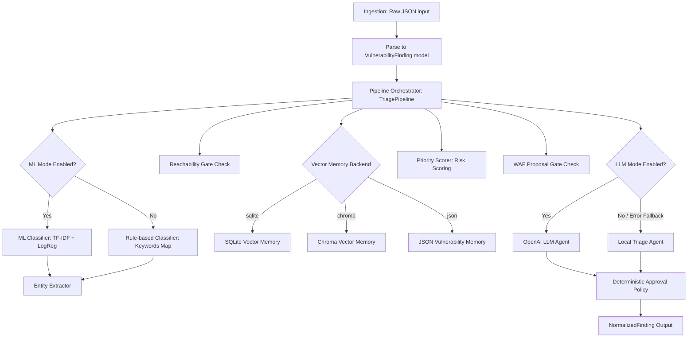

# Vuln AI Triage Lab v3 - প্রজেক্ট পরিচিতি ও কার্যপ্রণালী

এই প্রজেক্টটি একটি **AI-assisted AppSec vulnerability intelligence pipeline** বা স্বয়ংক্রিয় নিরাপত্তা ত্রুটি সনাক্তকরণ ও ট্রিয়েজ পাইপলাইন। এটি বিভিন্ন সিকিউরিটি টুলস (যেমন: SAST, DAST, SCA) থেকে প্রাপ্ত র ফিন্ডিংগুলোকে (raw findings) গ্রহণ করে সেগুলোকে একটি নির্দিষ্ট স্ট্যান্ডার্ডে রূপান্তর করে, ডুপ্লিকেট সনাক্ত করে, ত্রুটির গুরুত্ব অনুযায়ী স্কোরিং করে এবং ভার্চুয়াল প্যাচ বা WAF (Web Application Firewall) রুল প্রোপোজাল তৈরি করে।

সংস্করণ ৩ (v3) এ আগের রুল ও মেশিন লার্নিং কাঠামোর ওপরে একটি **অ্যাবস্ট্রাক্ট এমবেডিং প্রোভাইডার**, ** SQLite ও Chroma ভেক্টর মেমরি স্টোরেজ**, **ঐচ্ছিক OpenAI LLM ট্রিয়েজ**, **ডিটারমিনিস্টিক অনুমোদন পলিসি (Approval Policy)** এবং **হিউম্যান ফিডব্যাক লুপ** যুক্ত করা হয়েছে।

নিচে প্রতিটি কম্পোনেন্ট কীভাবে এবং কেন কাজ করে তা বাংলায় বিস্তারিত ব্যাখ্যা করা হলো।

---

## ১. ডাটা ফ্লো (System Architecture & Data Flow)

পাইপলাইনে ডাটা ফ্লো বা প্রসেসিং নিচের ধাপগুলো অনুসরণ করে সম্পন্ন হয় (যেখানে ইচ্ছে করলেই ML, LLM এবং ভেক্টর ব্যাকএন্ডগুলো টগল করা সম্ভব):

---

## ২. প্রতিটি কম্পোনেন্টের বিস্তারিত কোড ব্যাখ্যা (Component Breakdown)

### ক. ডাটা স্কিমা (Data Schemas)
* **ফাইল:** [app/schemas.py](file:///g:/vuln-ai-triage-lab/app/schemas.py)
* **কীভাবে কাজ করে:** **Pydantic** লাইব্রেরি ব্যবহার করে ইনপুট ও আউটপুট এর ডাটা স্ট্রাকচার নির্ধারণ করা হয়েছে। v3 সংস্করণে অতিরিক্ত প্যারামিটার যুক্ত করা হয়েছে:
  * `NormalizedFinding` মডেলে `agent_mode` (যেমন: `local_rules` বা `openai:gpt-4o-mini`), `memory_backend` (ভেক্টর সংরক্ষণের ধরন), এবং `approval_required_actions` (যেসব কাজের জন্য মানুষের রিভিউ লাগবে) যুক্ত করা হয়েছে।
  * `TriageFeedback`: মানুষের রিভিউ এবং অনুমোদন ডেটা সংরক্ষণের জন্য নতুন স্কিমা তৈরি করা হয়েছে (যার মধ্যে সিডব্লিউই সংশোধন, প্রায়োরিটি সংশোধন ও WAF রুল অ্যাপ্রুভাল ফিল্ড রয়েছে)।

---

### খ. ইনজেশন অ্যাডাপ্টার (Ingestion Adapter)
* **ফাইল:** [app/ingestion/adapters.py](file:///g:/vuln-ai-triage-lab/app/ingestion/adapters.py)
* **কীভাবে কাজ করে:** `parse_generic_findings` ফাংশনটি ইনপুট হিসেবে আসা কাঁচা বা র (raw) JSON ডাটাকে পার্স করে `VulnerabilityFinding` অবজেক্টের একটি লিস্টে পরিণত করে।

---

### গ. নরমালাইজেশন ও সিডব্লিউই ক্লাসিফিকেশন (CWE Classification & Normalization)
ত্রুটির টাইটেল ও ডেসক্রিপশন থেকে স্ট্যান্ডার্ড CWE কোড বের করার জন্য পাইপলাইন দুটি মোড ব্যবহার করে:
1. **রুল-ভিত্তিক ক্লাসিফায়ার:** [cwe_classifier.py](file:///g:/vuln-ai-triage-lab/app/normalization/cwe_classifier.py) (কি-ওয়ার্ড ম্যাচিং ও কন্ডিশনাল রুলস)।
2. **মেশিন লার্নিং ক্লাসিফায়ার:** [cwe_ml_classifier.py](file:///g:/vuln-ai-triage-lab/app/ml/cwe_ml_classifier.py) ও [train_cwe_classifier.py](file:///g:/vuln-ai-triage-lab/app/ml/train_cwe_classifier.py) (scikit-learn এর TF-IDF + Logistic Regression)।

---

### ঘ. এমবেডিং প্রোভাইডার (Embedding Providers)
* **ফাইল:** [app/embeddings/providers.py](file:///g:/vuln-ai-triage-lab/app/embeddings/providers.py)
* **কীভাবে কাজ করে:** 
  * এমবেডিং জেনারেশন প্রক্রিয়াকে আরও নমনীয় করতে `EmbeddingProvider` অ্যাবস্ট্রাকশন তৈরি করা হয়েছে।
  * **HashEmbeddingProvider:** SHA256 অ্যালগরিদমের সাহায্যে টোকেনাইজড শব্দগুলোকে ভেক্টরে রূপান্তর করে। এটি সম্পূর্ণ লোকাল ও জিরো-ডিপেন্ডেন্সি ব্যাকএন্ড।
  * **SentenceTransformerEmbeddingProvider:** Hugging Face এর রিয়াল নিউরাল নেটওয়ার্ক মডেল `sentence-transformers/all-MiniLM-L6-v2` লোড করে আসল সেম্যান্টিক এমবেডিং ভেক্টর তৈরি করে।

---

### ঙ. ডুপ্লিকেট সনাক্তকরণ ও ভেক্টর ডাটাবেজ ব্যাকএন্ড (Deduplication & Vector Memory)
মেমরি স্টোরেজকে সংরক্ষণযোগ্য করার জন্য v3 মডিউলে তিনটি অপশন বা ব্যাকএন্ড রয়েছে:

1. **SQLite Vector Database ([sqlite_vector_memory.py](file:///g:/vuln-ai-triage-lab/app/storage/sqlite_vector_memory.py)):**
   * এটি পাইথনের ইন-বিল্ট `sqlite3` ব্যবহার করে। ডেটা এবং এমবেডিং ভেক্টরগুলোকে JSON টেক্সট হিসেবে `memory_records` টেবিলে লেখে এবং ডিস্কে `vulnerability_memory.sqlite` ফাইলে সংরক্ষণ করে। কোসাইন সিমিলারিটি ক্যালকুলেশন মেথডের মাধ্যমে ডুপ্লিকেট চেক করে।
2. **ChromaDB Vector Store ([chroma_memory_store.py](file:///g:/vuln-ai-triage-lab/app/storage/chroma_memory_store.py)):**
   * এটি একটি রিয়াল ভেক্টর ডাটাবেজ। `chromadb.PersistentClient` ব্যবহারের মাধ্যমে ভেক্টর এবং ডকুমেন্টস সংরক্ষণ করে এবং সরাসরি ডাটাবেজ লেভেলে কুয়েরি রান করে মিলের হার (Similarity Score) হিসেব করে।
3. **JSON Vulnerability Memory ([memory_store.py](file:///g:/vuln-ai-triage-lab/app/storage/memory_store.py)):**
   * এটি সরল ফাইল ভিত্তিক মেমরি যা JSON অ্যারে আকারে ডিস্কে সেভ হয়।

---

### চ. রিচিবিলিটি গেট (Reachability Gate)
* **ফাইল:** [app/reachability/reachability_gate.py](file:///g:/vuln-ai-triage-lab/app/reachability/reachability_gate.py)
* **কীভাবে কাজ করে:** ফাইন্ডিংটির সোর্স টাইপ (SAST/DAST) এবং এন্ডপয়েন্ট ও প্যাকেজ সংক্রান্ত ডেটা নিয়ে রিচিবিলিটি (Reachable) ভ্যালু নির্ধারণ করে।

---

### ছ. প্রায়োরিটি স্কোরিং (Priority & Risk Scoring)
* **ফাইল:** [app/scoring/bayesian_score.py](file:///g:/vuln-ai-triage-lab/app/scoring/bayesian_score.py)
* **কীভাবে কাজ করে:** একটি গাণিতিক সমীকরণের মাধ্যমে ত্রুটির গুরুত্ব বা প্রায়োরিটি স্কোর হিসেব করে ঝুঁকি স্তর (Critical/High/Medium/Low) নির্ধারণ করে।

---

### জ. WAF গেট এবং ভার্চুয়াল প্যাচিং (WAF Gate / Virtual Patching)
* **ফাইল:** [app/waf/waf_gate.py](file:///g:/vuln-ai-triage-lab/app/waf/waf_gate.py)
* **কীভাবে কাজ করে:** এটি ModSecurity ভার্চুয়াল প্যাচ প্রস্তাবনা তৈরি করে। তবে এর জন্য কঠোর নিরাপত্তা গেট বসানো আছে (যেমন: SAST-Only ফাইন্ডিংসে WAF রুল ব্লক করা)।

---

### ঝ. ঐচ্ছিক OpenAI LLM ট্রিয়েজ এজেন্ট (LLM Triage Agent)
* **ফাইল:** [app/agents/llm_agent.py](file:///g:/vuln-ai-triage-lab/app/agents/llm_agent.py)
* **কীভাবে কাজ করে:** 
  * `use_llm=True` অন করা হলে এটি OpenAI এর `chat.completions` এপিআই ব্যবহার করে জেসন মোডে (`response_format={"type": "json_object"}`) রিকোয়েস্ট পাঠায়।
  * এটি ফাইন্ডিংয়ের প্রাসঙ্গিক ব্যাখ্যা এবং CWE অনুযায়ী ফিক্স সাজেশন জেনারেট করে।
  * যদি কোনো কারণে OpenAI API কি না থাকে বা নেটওয়ার্ক এরর দেয়, তবে এটি `local_triage_agent` এ স্বয়ংক্রিয়ভাবে ফিরে যায় (Fallback), যার ফলে সার্ভিস বন্ধ বা ক্র্যাশ হয় না।

---

### ঞ. অনুমোদন পলিসি (Deterministic Approval Policy)
* **ফাইল:** [app/policy/approval_policy.py](file:///g:/vuln-ai-triage-lab/app/policy/approval_policy.py)
* **কীভাবে কাজ করে:**
  * LLM এজেন্ট নিজের মতো কোনো অ্যাকশন নিতে পারে না। তাই মানুষের পর্যালোচনার প্রয়োজনীয়তা যাচাই করার জন্য এই ফাইলটি কাজ করে।
  * ফাইন্ডিংটিতে যদি কোনো প্রস্তাবিত WAF রুল থাকে, ঝুঁকি স্তর যদি High বা Critical হয়, অথবা এটি অন্য ত্রুটির ডুপ্লিকেট হয়, তবে এটি মানুষের পর্যালোচনার সিদ্ধান্তগুলো (`review_waf_virtual_patch`, `review_remediation_plan`, `review_duplicate_grouping`) আউটপুট অবজেক্টের `approval_required_actions` লিস্টে পুশ করে দেয়।

---

### ট. হিউম্যান ফিডব্যাক স্টোর (Human Feedback Store)
* **ফাইল:** [app/feedback/feedback_store.py](file:///g:/vuln-ai-triage-lab/app/feedback/feedback_store.py)
* **কীভাবে কাজ করে:**
  * মানুষের দেওয়া ফিডব্যাক (অনুমোদন, ফালস পজিটিভ মার্কিং, বা ভুল এপ্রুভাল) সরাসরি `api_human_feedback.jsonl` ফাইলে লগ হিসেবে যোগ করে। এটি ভবিষ্যতে ডেটা বিশ্লেষণ ও মডেল রি-ট্রেনিং করতে সাহায্য করে।

---

### ঠ. পাইপলাইন অর্কেস্ট্রেটর (Pipeline Orchestrator)
* **ফাইল:** [app/pipeline.py](file:///g:/vuln-ai-triage-lab/app/pipeline.py)
* **কীভাবে কাজ করে:** এটি উপরে বর্ণিত সকল মডিউল ও ডেটাকে একত্রিত করে। `process_one` ফাংশনের মাধ্যমে ইনপুট ফাইন্ডিংকে সবকটি ধাপের মধ্য দিয়ে প্রসেস করিয়ে ফাইনাল `NormalizedFinding` অবজেক্ট তৈরি করে।

---

## ৩. প্রজেক্টের ইন্টারফেস এবং ভেরিফিকেশন (Interfaces & Verification)

* **FastAPI অ্যাপ ([app/main.py](file:///g:/vuln-ai-triage-lab/app/main.py)):** 
  * `POST /triage` এবং `POST /triage/batch` এপিআই তে `?use_ml=true` এবং `?use_llm=true` কুয়েরি টগল ব্যবহার করা যায়। 
  * এছাড়া ফিডব্যাক সংরক্ষণ করার জন্য `POST /feedback` এবং রিভিউর সামারি দেখতে `GET /feedback/summary` ব্যবহার করা যায়।
* **CLI টুল ([app/cli.py](file:///g:/vuln-ai-triage-lab/app/cli.py)):**
  * সিএলআই-তে মেমরি ব্যাকএন্ড সেট করার জন্য `--memory-backend sqlite` এবং মেমরি ডেটা সংরক্ষণ করতে `--memory-file output/v3_memory.sqlite` রান করা যায়।
* **ডকার কম্পোজ ([docker-compose.yml](file:///g:/vuln-ai-triage-lab/docker-compose.yml)):**
  * ডকার কন্টেইনারে এপিআই রান করতে সাহায্য করে এবং `OPENAI_API_KEY` পাস করার সুবিধা দেয়।

---

## ৪. প্রজেক্টের গুরুত্বপূর্ণ সেফটি রুলস (Strict Safety Rules)

১. **LLM as an Advisor only:** ক্লাসিফিকেশন, স্কোরিং ও পলিসি গেট সম্পূর্ণ ডিটারমিনিস্টিক পাইথন কোডে লেখা। LLM শুধুমাত্র বিবরণী ব্যাখ্যা ও কোড ফিক্স লেখার কাজে সীমাবদ্ধ।
২. **SAST-Only rules blocking:** SAST-only ফাইন্ডিং কখনোই WAF রুল প্রস্তাব করবে না যাতে ফালস-পজিটিভ ট্রাফিক ব্লক না হয়।
৩. **Deterministic Approval triggers:** কোনো ঝুঁকিপূর্ণ কাজ স্বয়ংক্রিয়ভাবে প্রোডাকশনে যাবে না, মানুষের রিভিউ বা অনুমোদন আবশ্যক।
