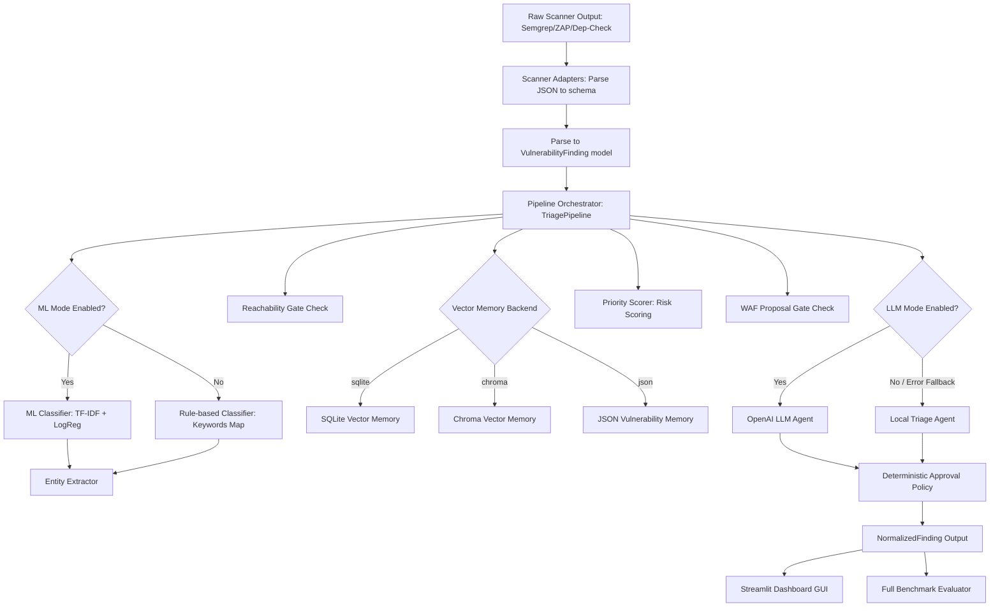

# Vuln AI Triage Lab v4 - প্রজেক্ট পরিচিতি ও কার্যপ্রণালী

এই প্রজেক্টটি একটি **AI-assisted AppSec vulnerability intelligence pipeline** বা স্বয়ংক্রিয় নিরাপত্তা ত্রুটি সনাক্তকরণ ও ট্রিয়েজ পাইপলাইন। এটি বিভিন্ন সিকিউরিটি টুলস (যেমন: SAST, DAST, SCA) থেকে প্রাপ্ত র ফিন্ডিংগুলোকে (raw findings) গ্রহণ করে সেগুলোকে একটি নির্দিষ্ট স্ট্যান্ডার্ডে রূপান্তর করে, ডুপ্লিকেট সনাক্ত করে, ত্রুটির গুরুত্ব অনুযায়ী স্কোরিং করে এবং ভার্চুয়াল প্যাচ বা WAF (Web Application Firewall) রুল প্রোপোজাল তৈরি করে।

সংস্করণ ৪ (v4) এ আগের ভেক্টর মেমরি ও এআই ট্রিয়েজ কাঠামোর ওপরে একটি **স্ক্যানার ইন্টিগ্রেশন লেয়ার (Semgrep, ZAP, Dependency-Check adapters)**, একটি ইন্টারেক্টিভ **Streamlit ড্যাশবোর্ড ইউজার ইন্টারফেস**, এবং একটি পূর্ণাঙ্গ **সিস্টেম বেঞ্চমার্ক ইভ্যালুয়েটর** যুক্ত করা হয়েছে।

নিচে প্রতিটি কম্পোনেন্ট কীভাবে এবং কেন কাজ করে তা বাংলায় বিস্তারিত ব্যাখ্যা করা হলো।

---

## ১. ডাটা ফ্লো (System Architecture & Data Flow)

পাইপলাইনে ডাটা ফ্লো বা প্রসেসিং নিচের ধাপগুলো অনুসরণ করে সম্পন্ন হয় (যেখানে ইচ্ছে করলেই ML, LLM এবং ভেক্টর ব্যাকএন্ডগুলো টগল করা সম্ভব):

---

## ২. প্রতিটি কম্পোনেন্টের বিস্তারিত কোড ব্যাখ্যা (Component Breakdown)

### ক. ডাটা স্কিমা (Data Schemas)
* **ফাইল:** [app/schemas.py](file:///g:/vuln-ai-triage-lab/app/schemas.py)
* **কীভাবে কাজ করে:** **Pydantic** লাইব্রেরি ব্যবহার করে ইনপুট ও আউটপুট এর ডাটা স্ট্রাকচার নির্ধারণ করা হয়েছে।
  * `VulnerabilityFinding`: নিরাপত্তা স্ক্যানার থেকে আসা রিপোর্টের কাস্টম পার্সড ডাটা রিপ্রেজেন্ট করে (যেমন: CVSS স্কোর, এন্ডপয়েন্ট, প্যারামিটার, ফাইল পাথ, প্যাকেজ, ভার্সন ইত্যাদি)।
  * `NormalizedFinding`: পাইপলাইনের সম্পূর্ণ প্রসেস শেষে ডুপ্লিকেট গ্রুপ আইডি, প্রায়োরিটি স্কোর, WAF রুলস, এবং মানুষের জন্য প্রয়োজনীয় রিভিউর লিস্ট ধারণ করে।

---

### খ. স্ক্যানার ইন্টিগ্রেশন ও ইনজেশন অ্যাডাপ্টার (Scanner Adapters & Ingestion)
বাস্তব অ্যাপসেক অপারেশনে একেকটি সিকিউরিটি টুলস একেক ফরম্যাটে ডাটা দেয়। v4 সংস্করণে এদের নরমালাইজ করার জন্য নির্দিষ্ট অ্যাডাপ্টার যোগ করা হয়েছে:

* **মডিউল:** [app/scanners/](file:///g:/vuln-ai-triage-lab/app/scanners/)
1. **Semgrep Adapter (`semgrep_adapter.py`):** এটি Semgrep SAST টুলের JSON আউটপুট রিড করে। ফাইল পাথ, কোডের লাইন নম্বর এবং কোড কনটেক্সট বিবরণীতে যুক্ত করে এবং টুলটির সেভেরিটিকে CVSS স্কোরে (১ থেকে ১০) রূপান্তর করে।
2. **OWASP ZAP Adapter (`zap_adapter.py`):** এটি ZAP DAST টুলের এলার্টস লিস্ট পড়ে আক্রান্ত এন্ডপয়েন্ট ও ইউআরএল প্যারামিটার এক্সট্র্যাক্ট করে এবং এ ধরনের ডাইনামিক ফাইন্ডিংকে রিচিবল ও DAST-Confirmed হিসেবে ভ্যালু সেট করে।
3. **Dependency-Check Adapter (`dependency_check_adapter.py`):** এটি SCA টুলের ডিপেন্ডেন্সি ও সিভিই (CVE) এর রেকর্ডগুলো পড়ে আক্রান্ত প্যাকেজ নাম এবং লাইব্রেরি ভার্সন পার্স করে।
4. **Fixture Runner (`run_all.py`):** লোকাল সিস্টেমে স্ক্যানারগুলো ইনস্টল না থাকলেও প্রজেক্টটি যাতে সরাসরি টেস্ট করা যায়, সেজন্য আগে থেকে সেভ করে রাখা স্ক্যানার জেসন ফাইলগুলোকে (`data/scanner_fixtures/`) রিড করে একটি সমন্বিত ক্যানোনিকাল জেসন পে-লোড তৈরি করে।

---

### গ. নরমালাইজেশন ও সিডব্লিউই ক্লাসিফিকেশন (CWE Classification & Normalization)
ত্রুটির টাইটেল ও ডেসক্রিপশন থেকে স্ট্যান্ডার্ড CWE কোড বের করার জন্য পাইপলাইন দুটি মোড ব্যবহার করে:
1. **রুল-ভিত্তিক ক্লাসিফায়ার:** [cwe_classifier.py](file:///g:/vuln-ai-triage-lab/app/normalization/cwe_classifier.py) (কি-ওয়ার্ড ম্যাচিং ও কন্ডিশনাল রুলস)।
2. **মেশিন লার্নিং ক্লাসিফায়ার:** [cwe_ml_classifier.py](file:///g:/vuln-ai-triage-lab/app/ml/cwe_ml_classifier.py) ও [train_cwe_classifier.py](file:///g:/vuln-ai-triage-lab/app/ml/train_cwe_classifier.py) (scikit-learn এর TF-IDF + Logistic Regression)।

---

### ঘ. এমবেডিং প্রোভাইডার (Embedding Providers)
* **ফাইল:** [app/embeddings/providers.py](file:///g:/vuln-ai-triage-lab/app/embeddings/providers.py)
* **কীভাবে কাজ করে:** এমবেডিং প্রসেসকে মডুলার করতে `HashEmbeddingProvider` (২৫৬-ডাইমেনশন SHA256 লোকাল হ্যাশ) এবং `SentenceTransformerEmbeddingProvider` (রিয়েল Hugging Face neural embedding) টগল করার ইন্টারফেস।

---

### ঙ. ডুপ্লিকেট সনাক্তকরণ ও ভেক্টর ডাটাবেজ ব্যাকএন্ড (Deduplication & Vector Memory)
* **মডিউল:** [app/storage/](file:///g:/vuln-ai-triage-lab/app/storage/)
* **কীভাবে কাজ করে:** ৩টি ডেটাবেজ অপশন সাপোর্ট করে: SQLite Vector DB (লোকাল রিলেশনাল জেসন অ্যারে), ChromaDB (লোকাল Persistent ভেক্টর ডাটাবেজ) এবং সাধারণ JSON ফাইল।

---

### চ. রিচিবিলিটি গেট (Reachability Gate)
* **ফাইল:** [app/reachability/reachability_gate.py](file:///g:/vuln-ai-triage-lab/app/reachability/reachability_gate.py)
* **কীভাবে কাজ করে:** সোর্স টাইপ ও এপিআই রাউটস কন্ডিশনের ওপর ভিত্তি করে ত্রুটির রিচিবিলিটি (`True`/`False`) নির্ধারণ করে।

---

### ছ. প্রায়োরিটি স্কোরিং (Priority & Risk Scoring)
* **ফাইল:** [app/scoring/bayesian_score.py](file:///g:/vuln-ai-triage-lab/app/scoring/bayesian_score.py)
* **কীভাবে কাজ করে:** CVSS, reachability, asset exposure, criticality, এবং duplication status ও ওজনের গাণিতিক সূত্রে ঝুঁকি প্রায়োরিটি স্কোর তৈরি করে।

---

### জ. WAF গেট এবং ভার্চুয়াল প্যাচিং (WAF Gate / Virtual Patching)
* **ফাইল:** [app/waf/waf_gate.py](file:///g:/vuln-ai-triage-lab/app/waf/waf_gate.py)
* **কীভাবে কাজ করে:** এটি ModSecurity ভার্চুয়াল প্যাচ প্রস্তাবনা তৈরি করে। তবে এর জন্য কঠোর নিরাপত্তা গেট বসানো আছে (যেমন: SAST-Only ফাইন্ডিংসে WAF রুল ব্লক করা)।

---

### ঝ. ঐচ্ছিক OpenAI LLM ট্রিয়েজ এজেন্ট (LLM Triage Agent)
* **ফাইল:** [app/agents/llm_agent.py](file:///g:/vuln-ai-triage-lab/app/agents/llm_agent.py)
* **কীভাবে কাজ করে:** `use_llm=True` অন করা হলে OpenAI এপিআই ব্যবহার করে জেসন মোডে ত্রুটির বিবরণী ও ফিক্স সাজেশন জেনারেট করে। ব্যর্থ হলে স্বয়ংক্রিয়ভাবে লোকাল রুল মোডে ফিরে যায় (Fallback)।

---

### ঞ. অনুমোদন পলিসি (Deterministic Approval Policy)
* **ফাইল:** [app/policy/approval_policy.py](file:///g:/vuln-ai-triage-lab/app/policy/approval_policy.py)
* **কীভাবে কাজ করে:** এটি ডাইরেক্ট কোড লেভেলে মেপে বের করে কোন কোন কাজের জন্য মানুষের ম্যানুয়াল রিভিউ বা অনুমোদন লাগবে (যেমন: WAF প্যাচিং, ক্রিটিক্যাল ফিক্স, ডুপ্লিকেট মার্জ)।

---

### ট. হিউম্যান ফিডব্যাক স্টোর (Human Feedback Store)
* **ফাইল:** [app/feedback/feedback_store.py](file:///g:/vuln-ai-triage-lab/app/feedback/feedback_store.py)
* **কীভাবে কাজ করে:** মানুষের দেওয়া অনুমোদন বা রিভিউ ফিডব্যাক সরাসরি `api_human_feedback.jsonl` ফাইলে লগ হিসেবে যোগ করে।

---

### ঠ. পাইপライン অর্কেস্ট্রেটর (Pipeline Orchestrator)
* **ফাইল:** [app/pipeline.py](file:///g:/vuln-ai-triage-lab/app/pipeline.py)
* **কীভাবে কাজ করে:** এটি ইনপুট ফাইন্ডিংকে সবকটি মডিউলের মধ্য দিয়ে প্রসেস করিয়ে ফাইনাল `NormalizedFinding` অবজেক্ট তৈরি করে।

---

## ৩. ইউজার ইন্টারফেস ও ইভ্যালুয়েশন (Streamlit Dashboard & Full Benchmark)

সংস্করণ ৪ এ ব্যবহারকারীদের ভিজ্যুয়াল অপারেশন এবং পাইপলাইনের সঠিকতা মূল্যায়নের জন্য দুটি বিশেষ মডিউল যুক্ত করা হয়েছে:

### ১. ইন্টারঅ্যাকটিভ স্ট্রিমলিট ড্যাশবোর্ড (Streamlit Dashboard UI)
* **ফাইল:** [streamlit_app.py](file:///g:/vuln-ai-triage-lab/app/dashboard/streamlit_app.py)
* **কীভাবে কাজ করে:** 
  * এটি একটি ভিজ্যুয়াল ওয়েব ইন্টারফেস প্রদান করে। আপনি চাইলে জেসন ফাইল আপলোড করতে পারেন অথবা ডিফল্ট স্ক্যানার ফাইল লোড করতে পারেন।
  * এটি মোট ফাইন্ডিংস, ক্রিটিক্যাল সংখ্যা, ডুপ্লিকেট ভিউ এবং প্রস্তাবিত WAF রুলসের সংখ্যা মেট্রিকে প্রদর্শন করে।
  * ইউজাররা ইন্টারঅ্যাকটিভ ড্রপডাউন থেকে যেকোনো ত্রুটি সিলেক্ট করে তার এআই জেনারেটেড ব্যাখ্যা, সমাধানের কোড এবং WAF ModSecurity রুল সরাসরি স্ক্রিনে দেখতে পারেন।

### ২. ফুল সিস্টেম বেঞ্চমার্ক ইভ্যালুয়েটর (Full Benchmark Evaluator)
* **ফাইল:** [full_benchmark.py](file:///g:/vuln-ai-triage-lab/app/evaluation/full_benchmark.py)
* **কীভাবে কাজ করে:**
  * এটি রুল এবং এমএল ক্লাসিফায়ারের পারফরম্যান্স যাচাই করতে স্ক্যানার আউটপুটের ওপর সম্পূর্ণ ইভ্যালুয়েশন রান করে।
  * এটি টার্গেট গোল হিসেবে সিডব্লিউই ক্লাসিফিকেশন একুরেসি (`cwe_accuracy`), প্রায়োরিটি র্যাংক একুরেসি (`priority_rank_accuracy`), এবং অননুমোদিত WAF রুলের ভুল প্রস্তাবনা রেট (`waf_false_positive_rate`) মেপে রিপোর্ট তৈরি করে।

---

## ৪. প্রজেক্টের গুরুত্বপূর্ণ সেফটি রুলস (Strict Safety Rules)

১. **Scanner schema isolation:** কাঁচা স্ক্যানার ডেটা সরাসরি এআই পাইপলাইনে প্রসেস হয় না, অ্যাডাপ্টারের মাধ্যমে ক্যানোনিকাল স্কিমা রূপান্তর হওয়ার পর প্রসেস হয়।
২. **SAST WAF Rules blocking:** SAST-only ফাইন্ডিং কখনোই WAF রুল প্রস্তাব করবে না যাতে ফালস-পজিটিভ ট্রাফিক ব্লক না হয়।
৩. **Human approval actions:** যেকোনো সেফটি ও পলিসি ভায়োলেশন বা অ্যাকশনের সাথে `approval_required_actions` লিস্ট জেনারেট হয়ে যায় যা মানুষের অনুমোদন বাধ্য করে।
