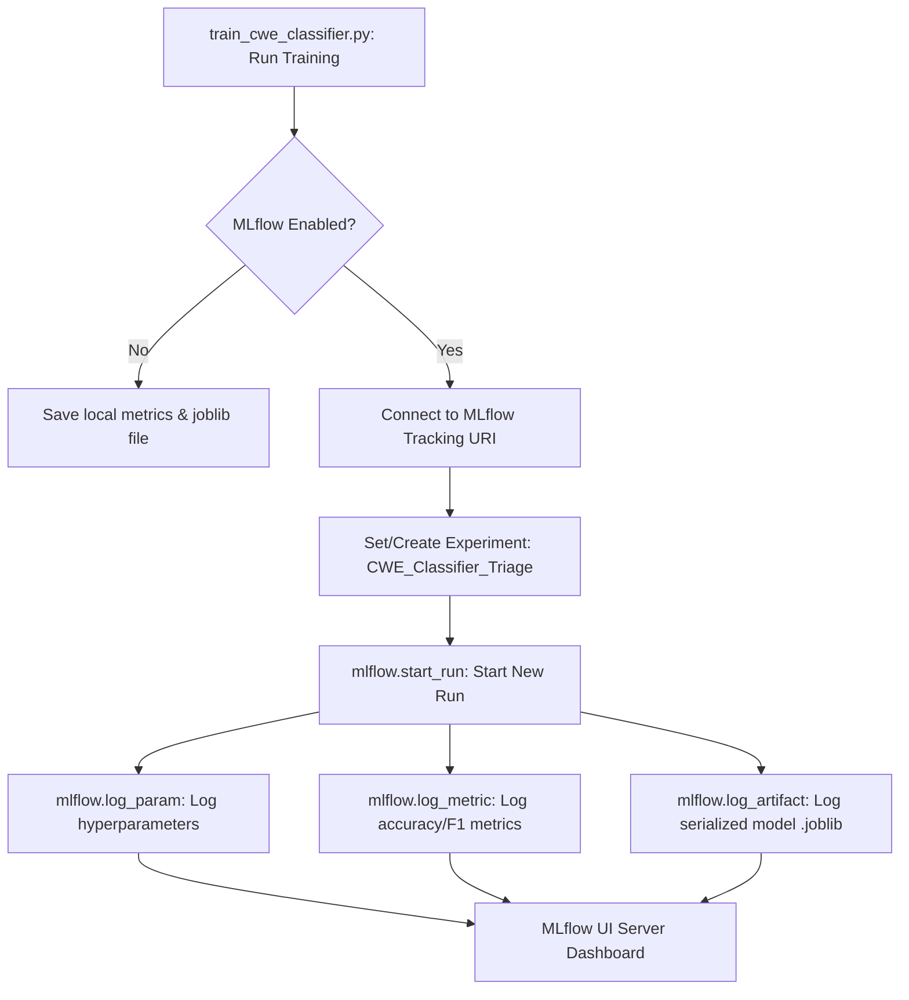

# Vuln AI Triage Lab v7.0 - প্রজেক্ট পরিচিতি ও কার্যপ্রণালী

সংস্করণ ৭.০ (v7.0) আপগ্রেডে প্রজেক্টের এমএল অপস (MLOps) সক্ষমতা বৃদ্ধির লক্ষ্যে **MLflow Experiment Tracking** যুক্ত করা হয়েছে। এর ফলে CWE ক্লাসিফায়ার ট্রেইনিংয়ের সমস্ত হাইপারপ্যারামিটার, পারফরম্যান্স ইভালুয়েশন ম্যাট্রিক্স এবং সেভ করা মডেল ফাইলগুলোকে কেন্দ্রীয়ভাবে ট্র্যাক, অডিট এবং ভিজ্যুয়ালাইজ করা সম্ভব।

নিচে v7.0 এর আর্কিটেকচার, ডেক্সটপ ফ্লো এবং নতুন যুক্ত হওয়া কম্পোনেন্টগুলোর বিস্তারিত ব্যাখ্যা দেওয়া হলো।

---

## ১. ডাটা ফ্লো (System Architecture & Data Flow)

পাইপলাইনের ট্রেইনিং লুপ এখন সরাসরি লোকাল বা রিমোট MLflow ট্র্যাকিং সার্ভারের সাথে সংযুক্ত:

---

## ২. নতুন ও পরিবর্তিত কম্পোনেন্টের বিস্তারিত কোড ব্যাখ্যা

### ক. এমএলফ্লো ইন্টিগ্রেশন লজিক (MLflow Logging Blocks)
* **ফাইল:** [train_cwe_classifier.py](file:///g:/vuln-ai-triage-lab/app/ml/train_cwe_classifier.py)
* **কীভাবে কাজ করে:** 
  * `train_classifier` ফাংশনে `use_mlflow`, `mlflow_tracking_uri` এবং `mlflow_experiment` প্যারামিটারগুলো যোগ করা হয়েছে।
  * ট্রেইনিং শেষে মডেল ইভালুয়েশন ডাটা জেনারেট হওয়ার পর কোডটি ডাইনামিকলি `mlflow` ইম্পোর্ট করে এবং রান সেশন চালু করে।
  * **প্যারামিটার লগিং:** `encoder_type`, `embedding_model`, `test_size`, `random_state`, `training_rows` ইত্যাদি প্যারামিটার রেকর্ড করা হয়।
  * **ম্যাট্রিক্স লগিং:** প্রতিটি ট্রেইনিংয়ের `accuracy`, `macro_f1` এবং `weighted_f1` স্কোর স্টোর করা হয়।
  * **আর্টিফ্যাক্ট রেজিস্ট্রি:** চূড়ান্তভাবে সেভ হওয়া হালকা ২০KB-এর `.joblib` মডেল ফাইলটি সরাসরি রানের ডিরেক্টরিতে আপলোড করা হয়।

---

### খ. কমান্ড লাইনে নতুন আর্গুমেন্ট (CLI Flags)
* **ফাইল:** [train_cwe_classifier.py](file:///g:/vuln-ai-triage-lab/app/ml/train_cwe_classifier.py)
* **কীভাবে কাজ করে:**
  * `--mlflow`: এটি একটি বুলিয়ান সুইচ যা ট্র্যাকিং সক্রিয় করে।
  * `--mlflow-tracking-uri`: কাস্টম ট্র্যাকিং সার্ভারের লিঙ্ক (ডিফল্ট লোকাল ডিরেক্টরি `./mlruns`)।
  * `--mlflow-experiment`: কোন এক্সপেরিমেন্ট ক্যাটাগরিতে রানটি সেভ হবে তা নির্ধারণ করে (ডিফল্ট: `CWE_Classifier_Triage`)।

---

### গ. অ্যাডভান্সড ডিপেনডেন্সি ফাইল আপডেট
* **ফাইল:** [requirements-advanced.txt](file:///g:/vuln-ai-triage-lab/requirements-advanced.txt)
* **কীভাবে কাজ করে:**
  * কুবারনেটিস বা লোকাল ডিপ্লোয়মেন্ট এনভায়রনমেন্টের জন্য `tf-keras` ডিপেনডেন্সি যোগ করা হয়েছে যা Keras 3 জনিত কনফ্লিক্ট সমাধান করে এবং নির্বিঘ্নে Sentence-Transformers রান হতে সাহায্য করে।

---

## ৩. মডেল টেস্টিং ও ভ্যালিডেশন (Unit Tests & Automation)

* **ফাইল:** [test_v5_calibration_and_policy.py](file:///g:/vuln-ai-triage-lab/tests/test_v5_calibration_and_policy.py)
* **কীভাবে কাজ করে:**
  * `test_train_classifier_logs_to_mlflow` টেস্ট কেসটি মক (Mock) লাইব্রেরি ব্যবহার করে MLflow API কলগুলো সফলভাবে ইন্টারসেপ্ট ও ভ্যালিডেট করে।
  * এটি টেস্ট এনভায়রনমেন্টে লাইভ সার্ভার ছাড়াই নিশ্চিত করে যে MLflow-এর `log_param`, `log_metric`, এবং `log_artifact` সঠিক ভ্যালু সহ কল হচ্ছে।

---

## ৪. কেন এই পরিবর্তন গুরুত্বপূর্ণ (MLOps Best Practices)

১. **মডেলের ইতিহাস ও সংস্করণ নিয়ন্ত্রণ (Auditable Reproducibility):** অতীতে কোন মডেলটি কোন ডেটাসেট বা কি ধরনের এমবেডিংস ব্যাকএন্ড দিয়ে ট্রেইন করা হয়েছিল তা সরাসরি ড্যাশবোর্ড থেকে অডিট করা যায়।
২. **সহজ পারফরম্যান্স তুলনা (Run Comparison):** একাধিক রানের কনফিডেন্স স্কোর ও একুরেসি একসাথে পাশাপাশি রেখে তুলনা (Compare runs) করা সম্ভব।
৩. **আর্টিফ্যাক্ট ট্র্যাকিং (Centralized Registry):** ট্রেইন করা ফাইনাল মডেলটি সরাসরি আর্টিফ্যাক্ট হিসেবে সেভ থাকায় কোনো ডেভেলপার লোকাল ফাইল হারিয়ে ফেললেও MLflow থেকে সরাসরি মডেল ফাইল রিকভার করা যায়।
